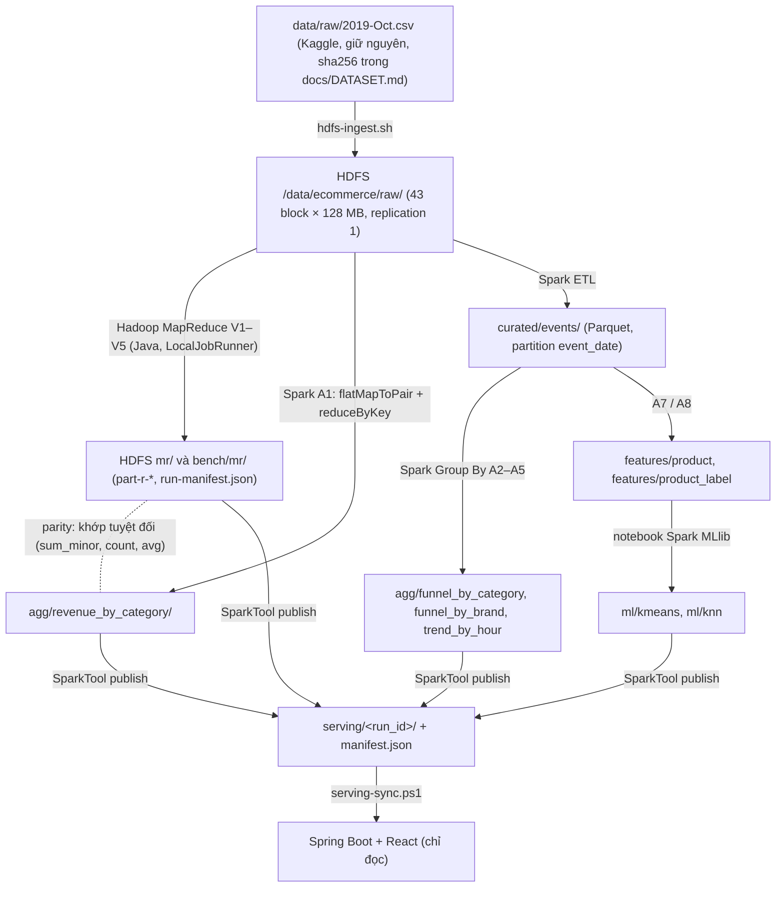

# Chạy end-to-end và kịch bản demo

Tài liệu này nối các bước đã được chạy thật trên máy nhóm (Windows 11, RAM 7,9 GB) thành một luồng. Chi tiết từng phần:
HDFS/MapReduce `docs/docker.md`, Spark `docs/spark-local.md`, ML `docs/ML.md`, web `webapp/README.md`,
kế hoạch và trạng thái `docs/PROJECT_AUDIT_AND_IMPLEMENTATION_PLAN.md`.

Chỉ cần xem web demo thì không phải chạy lại gì: repo đã kèm serving run `serving/20261007-015257-b0376ef-d3/`,
xem `docs/HUONG_DAN_CHAY.md` mức 1. Tài liệu này dành cho việc tái lập toàn bộ kết quả từ dataset gốc.

## 1. Kiến trúc Big Data



| Engine | Vai trò | Bài toán |
|---|---|---|
| HDFS (Docker: NameNode + DataNode) | Lưu raw, curated, aggregate, features, model, serving | — |
| Hadoop MapReduce (Docker, LocalJobRunner) | Chứng minh Map/Combine/Shuffle/Reduce; oracle đối chiếu; benchmark V1–V5 | A1 doanh thu theo `category_id` |
| Spark 4.0.4 (Java, local trên host) | A1 đối chứng; ETL; Group By A2–A5; đặc trưng A7, nhãn A8 | A1–A8 |
| Spark MLlib (notebook) | StandardScaler, K-Means, Logistic Regression; KNN bằng numpy | ML |

Hadoop MapReduce không chạy trên YARN (LocalJobRunner đọc/ghi HDFS). Spark không dùng MapReduce; `reduceByKey` là cơ chế của Spark.

## 2. Chạy lại toàn bộ (thứ tự, thời gian đo trên máy nhóm)

Một lần: Docker Desktop, JDK 21, `.venv` theo `docs/spark-local.md`, `config/spark-local.env`, dataset đặt sẵn ở `data/raw/`.
Không chạy MR, Spark, notebook đồng thời (RAM).

```powershell
docker compose build bigdata                           # image bigdata (Maven + JDK 11) cho MR, module bigdata
docker compose up -d namenode datanode                 # HDFS; kiểm tra: docker compose exec namenode hdfs dfsadmin -report
docker compose exec namenode bash /opt/bigdata/scripts/hdfs-ingest.sh 2019-Oct.csv     # ~12 phút, không ghi đè
$env:MSYS_NO_PATHCONV = "1"   # chỉ khi dùng Git Bash
docker compose run --rm bigdata scripts/hdfs-sample.sh /data/ecommerce/raw/2019-Oct.csv 0.01 21   # D1 (0.1 = D2)
docker compose run --rm bigdata scripts/hdfs-mr.sh /data/ecommerce/raw/sample/2019-Oct-r0.01-s21.csv <RUN_ID>   # MR V1–V5 + compare
docker compose run --rm bigdata python3 scripts/benchmark.py --matrix config/bench/mr-e2-d3.json   # E2 D3 (V1, V2, V5 × 4 lần): ~97 phút
.\scripts\spark-local.ps1 build                        # jar Spark + 25 test
.\scripts\spark-pipeline.ps1 -InputPath /data/ecommerce/raw/2019-Oct.csv -Tag d3                  # A1..A8 trên D3: ~83 phút
# notebook K-Means (~5 phút) và KNN (~19 phút): xem docs/ML.md
.\scripts\spark-bench-all.ps1; py -3 scripts\bench_summary.py                                     # E4/E5 + bảng tổng hợp
.\scripts\spark-local.ps1 submit publish --tag d3 --revenue-run-id <A1> `
   --mr-output hdfs://localhost:8020/data/ecommerce/bench/mr/e2-d3/<report>-1-v1 `
   --etl-run-id <ETL> --metrics-run-id <A2-A5> --kmeans-run-id <KMEANS> --knn-run-id <KNN> `
   --benchmarks-dir docs\evidence\bench\serving
.\scripts\serving-sync.ps1 -RunId <SERVING_RUN> -SetLatest
docker compose stop namenode datanode                  # web không cần HDFS
docker compose --profile web up -d --build            # web: web-backend (API) + web-frontend (Nginx), http://localhost:8080
```

Chạy lại an toàn: mọi output ghi vào thư mục mới theo `run_id` (`ErrorIfExists`/create-only); raw không bị ghi đè;
serving run bất biến (`serving-sync.ps1` từ chối run đã có). Dọn run cũ là thao tác thủ công.

## 3. Kịch bản demo (khoảng 10 phút)

1. **HDFS** (1 phút): NameNode UI `http://localhost:9870` → `/data/ecommerce/raw/2019-Oct.csv` (43 block);
   `docs/evidence/hdfs/source-2019-Oct/` (fsck HEALTHY, sha256 qua HDFS trùng file gốc).
2. **MapReduce** (2 phút): `bigdata/src/main/java/vn/edu/bigdata/revenue/hadoop/v1` (Mapper/Reducer) và V2–V5; `RecordReductionIT`;
   bảng E2/E3 ở `docs/evidence/bench/SUMMARY.md` (map output records 742 849 → 15 511 với combiner → 86 với V5).
3. **Spark** (2 phút): `RevenueJob` (flatMapToPair + reduceByKey), lineage `revenue-rdd-lineage.txt`; parity MR V1 = Spark A1 trên cả tháng (567/567 nhóm).
4. **Web** (4 phút), HDFS/Spark đã tắt:
   - Tổng quan: serving run, badge "KHỚP TUYỆT ĐỐI", chất lượng dữ liệu, danh sách artifact + sha256.
   - Group By: doanh thu theo danh mục, funnel, xu hướng theo giờ.
   - MapReduce vs Spark: bảng E2–E6 có min–max và phạm vi đo (một máy).
   - `/ml/kmeans`: silhouette/inertia theo K, hồ sơ cụm; chọn sản phẩm → **Predict Cluster** (Java) → so với cụm Spark đã gán; sửa số đếm trong form → cụm thay đổi.
   - `/ml/knn`: metric test so với baseline và Logistic Regression, confusion matrix; chọn sản phẩm test → **Predict** → nhãn dự đoán, vote_share, 15 láng giềng, nhãn thật.
5. **Truy vết** (1 phút): một số trên web → `manifest.json` (run_id nguồn) → `_run.json` trên HDFS → log trong `docs/evidence/`.

Câu hỏi phản biện cần chuẩn bị: plan §17.1 (6 câu về MapReduce/HDFS) và:
vì sao KNN thua Logistic Regression; vì sao không dùng accuracy; vì sao K-Means chọn K = 2; vì sao backend không gọi Spark.
