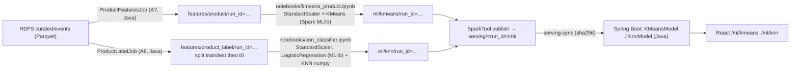

# Machine Learning: K-Means và KNN trên đặc trưng sản phẩm

Phần mở rộng sau bài toán Group By. ML **không** chạy trên sự kiện thô: mọi đặc trưng là kết quả Group By `product_id` do job
Spark Java tạo trên HDFS. Số liệu trong tài liệu này là kết quả chạy thật trên D3 (cả tháng 10/2019); chi tiết và bản D2 ở
`docs/evidence/ml/README.md`. Thiết kế ban đầu và lý do chọn hướng: plan §9, §15.1 (D6) và `REQUIRMENT.md` mục E.

## 1. Kiến trúc: huấn luyện offline, suy luận online



| Giai đoạn | Công cụ | Chạy ở đâu |
|---|---|---|
| Đặc trưng, nhãn | Spark Java (`ProductFeaturesJob`, `ProductLabelJob`) | Batch, `spark-submit` local trên host, đọc/ghi HDFS |
| Huấn luyện + đánh giá | Notebook PySpark (Spark MLlib) + numpy cho KNN | Batch, `jupyter nbconvert --execute`, tham số qua biến môi trường, output lưu trong notebook |
| Lưu mô hình | Model Spark (`.save`) + `model.json`/`metrics.json`/`metadata.json` | HDFS `/data/ecommerce/ml/{kmeans,knn}/run_id=…/` |
| Phát hành | `SparkTool publish` + `scripts/serving-sync.ps1` | HDFS → `./serving/<run_id>/` có sha256 |
| Suy luận | Java trong Spring Boot | Online, không cần Spark/HDFS; parity test với Spark/numpy |

## 2. Đặc trưng (A7) và nhãn (A8)

Một dòng = một `product_id`. Lọc `views ≥ 20` để các tỷ lệ ổn định (D3: giữ 92 592/166 794 sản phẩm).

| Đặc trưng | Công thức | Lý do |
|---|---|---|
| `log_views`, `log_carts`, `log_purchases`, `log_distinct_users` | `log1p(số đếm)` | Số đếm lệch phải mạnh (views p50 = 25, p99 = 3 091) |
| `cart_rate`, `purchase_rate` | `carts/views`, `purchases/views` | Mức chuyển đổi, không phụ thuộc độ phổ biến |
| `log_median_price` | `log1p(percentile_approx(price, 0.5))` | Mức giá |
| `recent_view_share` (chỉ A8) | views 7 ngày cuối trước t0 / views 14 ngày | Xu hướng gần đây |

Không dùng: `category`/`brand` (để diễn giải cụm và tránh mô hình học thuộc danh mục), `remove_from_cart` (0 sự kiện trong tháng 10/2019),
`revenue` (gần bằng purchases × giá, trùng thông tin). Chuẩn hóa `StandardScaler(withMean=true, withStd=true)` của Spark MLlib.

**Nhãn KNN (A8).** Dataset không có nhãn sẵn; nhãn được định nghĩa từ dữ liệu theo thời gian:
- đặc trưng chỉ từ sự kiện trong `[t0 − 14 ngày, t0)`; nhãn = 1 nếu có ≥ 1 purchase trong `[t0, t0 + 7 ngày)`;
- train: `t0 = 2019-10-15`; test: `t0 = 2019-10-25` (cửa sổ nhãn train kết thúc 10-22, trước t0 test);
- job kiểm tra `max(event_time lịch sử) < t0` và dữ liệu phủ hết cửa sổ nhãn; vi phạm thì dừng;
- validation = 20% sản phẩm của ảnh chụp train (hash `product_id`, seed 21); scaler chỉ fit trên phần còn lại.

Nhãn này cần dữ liệu cả tháng: mẫu D2 lấy theo dòng làm số purchase mỗi sản phẩm nhỏ đi khoảng 10 lần.

## 3. K-Means

- Câu hỏi: sản phẩm có tạo thành nhóm hành vi khác biệt không? Giả thuyết: silhouette của K chọn được cao hơn rõ hai baseline
  (xáo độc lập từng cột; chia theo phân vị giá).
- K ∈ 2..10 (cấu hình `ML_KMEANS_K_MIN/MAX`, hoặc `ML_KMEANS_K` để cố định), 3 seed, `k-means||`, `maxIter = 50`.
  Quy tắc chọn cố định trước: silhouette trung bình cao nhất, hòa → K nhỏ hơn.
- Metric: inertia (`summary.trainingCost`), silhouette (`ClusteringEvaluator`, squared Euclidean), kích thước cụm.

Kết quả D3 (run `20261006-235739-b0376ef-d3`): K = 2, silhouette 0,649 so với 0,316 (xáo cột) và 0,183 (phân vị giá).
Cụm 0 (17 356 sản phẩm): views TB 1 912, 98,5% có purchase; cụm 1 (75 236): views TB 94, 30,9% có purchase.
Hai cụm tách theo mức tương tác/chuyển đổi, không theo giá. Đây là tương quan, không phải nhân quả.
Giới hạn: K = 2 là phân tách thô; silhouette thiên về K nhỏ; `log_views` và `log_distinct_users` tương quan mạnh nên trục "độ phổ biến" chiếm ưu thế.

E7 (thuật toán lặp và cache, luận điểm Chương 1): cache giảm thời gian fit khoảng 16% (median 4 849 so với 5 770 ms, 20 vòng lặp),
nhưng chi phí nạp cache (5,7–10,3 s) lớn hơn phần tiết kiệm ở quy mô 92 592 × 7.

## 4. KNN phân loại

- Câu hỏi: từ hành vi 14 ngày trước t0, sản phẩm có purchase trong 7 ngày tới không?
- KNN chính xác (Euclidean² trên đặc trưng chuẩn hóa), K ∈ {3, 5, 7, 9, 15} (`ML_KNN_K_VALUES`); ngưỡng `vote_share` chọn theo F1 validation.
- Baseline: lớp đa số; luật "đã có purchase trong lịch sử"; Logistic Regression (Spark MLlib) làm mốc tham chiếu.
- Chỉ số chính: precision/recall/F1 lớp dương, PR-AUC, balanced accuracy; vẫn báo accuracy và confusion matrix. Bootstrap 1 000 lần.

Kết quả test D3 (run `20261007-000421-b0376ef-d3`, 64 254 sản phẩm, 25,3% dương):

| Mô hình | F1 | PR-AUC | Balanced acc. | Accuracy |
|---|---:|---:|---:|---:|
| KNN (K = 15, ngưỡng 0,40) | 0.621 | 0.671 | 0.749 | 0.803 |
| Luật lịch sử | 0.573 | 0.409 | 0.729 | 0.709 |
| Lớp đa số | 0 | 0.253 | 0.500 | 0.747 |
| Logistic Regression | 0.637 | 0.718 | 0.762 | 0.806 |

KNN vượt hai baseline đơn giản (CI 95% của F1 KNN − F1 luật lịch sử = [0,044; 0,054]) nhưng **thua Logistic Regression**.
K tốt nhất nằm ở biên lưới K. `vote_share` là tỷ lệ phiếu, không phải xác suất đã hiệu chỉnh.

Hướng B (tìm sản phẩm tương đồng, chỉ trên D2) là kết quả phụ: agreement@10 cùng danh mục 0,054, cao hơn ngẫu nhiên (0,013)
nhưng không vượt baseline "sản phẩm phổ biến" (0,063) — kết quả âm một phần, xem evidence.

## 5. Lưu mô hình và tái lập

Mỗi lần chạy notebook có `run_id = <thời gian>-<git sha>-<tag>`, ghi vào thư mục mới trên HDFS (không ghi đè) và bản sao cục bộ
`results/ml/<run_id>/`. Notebook kiểm tra trước khi kết thúc: suy luận ngoài Spark từ `model.json` (K-Means) hoặc từ
`train_set` đọc lại trên HDFS (KNN) phải khớp 100% kết quả đánh giá, nếu không `assert` làm notebook thất bại.

```powershell
docker compose up -d namenode datanode
.\scripts\spark-pipeline.ps1 -InputPath /data/ecommerce/raw/2019-Oct.csv -Tag d3        # A1..A8, ghi docs\evidence\spark-java\d3-run-ids.tsv
cd notebooks
$env:ML_TAG = "d3"            # các biến khác: ML_KMEANS_K, ML_KMEANS_K_MIN/MAX, ML_KNN_K_VALUES, ML_SEED, ML_KNN_MAX_TRAIN
..\.venv\Scripts\jupyter-nbconvert.exe --to notebook --execute --inplace --ExecutePreprocessor.timeout=-1 kmeans_product.ipynb
..\.venv\Scripts\jupyter-nbconvert.exe --to notebook --execute --inplace --ExecutePreprocessor.timeout=-1 knn_classifier.ipynb
```

Biến cố định: seed (K-Means 1/2/3, KNN 21), Spark 4.0.4, JDK 21.0.12, Python 3.12.10, `local[2]`, driver 1 GB.
Thời gian trên máy nhóm (D3): notebook K-Means 5,5 phút; notebook KNN 19 phút (dự đoán brute force 64 254 × 60 876 mất 6,7 phút).
