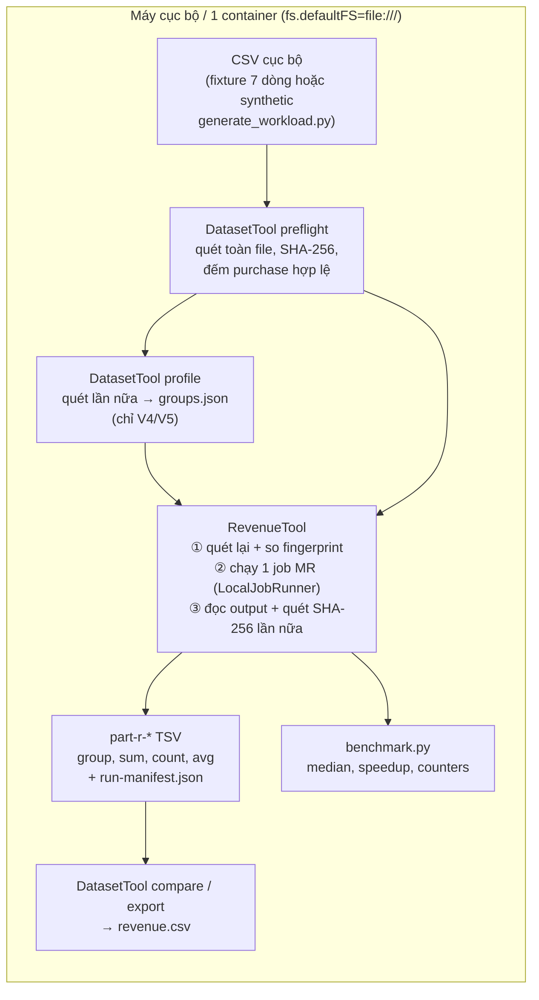
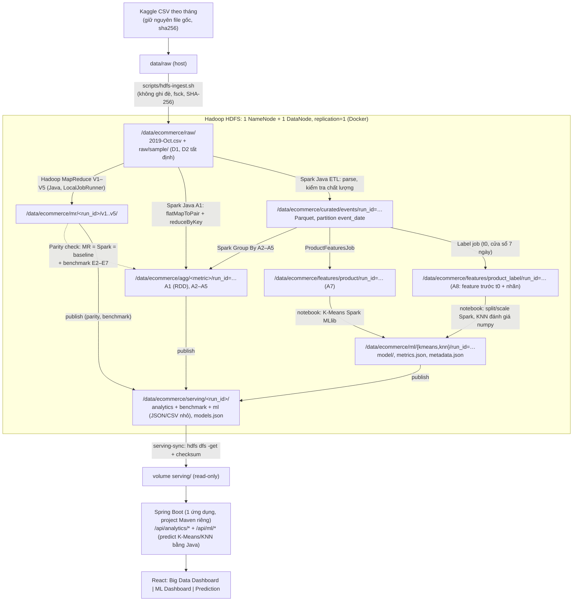
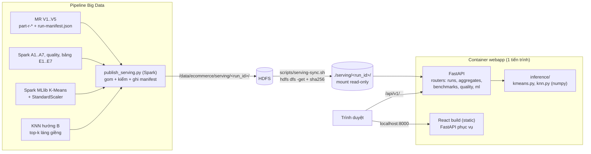

# Khảo sát hiện trạng và kế hoạch triển khai — BTL Dữ liệu lớn 2026, Bài 21 (Group By Aggregation)

> **Phạm vi tài liệu.** Khảo sát (2026-10-05) và kế hoạch, được cập nhật theo tiến độ triển khai. Ở lần khảo sát đầu tiên chưa sửa code, chưa build, chưa chạy job; từ 2026-10-06 các giai đoạn 0–2 và 4 đã được triển khai và chạy (xem các khối “Cập nhật” bên dưới). §1.1, §2 và §4 giữ nguyên nhận định **tại thời điểm khảo sát** (commit `88fd989`) làm lịch sử; trạng thái hiện hành nằm ở §3, §10, §12.
> Mọi số liệu trích dẫn đều trỏ tới evidence trong repository. Số liệu hiệu năng chính thức chỉ lấy từ các lần đo có lặp của giai đoạn 3.
>
> Ngày khảo sát: 2026-10-05 · Commit khảo sát: `88fd989` (nhánh `main`) · Máy khảo sát: Windows 11, i5-9300HF 4 nhân/8 luồng, **RAM 7,9 GB**.
>
> **Cập nhật 2026-10-06 — Giai đoạn 0 hoàn tất** (T0.1–T0.5): repo build và test được trong Docker trên máy Windows; demo fixture khớp oracle. Bằng chứng: `docs/evidence/windows-docker/README.md`. Các dòng #7, #15, #19, F1, F2 và §4.3 đã được cập nhật tương ứng. Nhận định gốc ở §1.1 mục 6 được giữ lại làm lịch sử khảo sát.
>
> **Cập nhật 2026-10-06 — Giai đoạn 1 (T1.1–T1.6) hoàn tất, trừ T1.7 (tùy chọn):** HDFS trong Docker, nạp `2019-Oct.csv`, mẫu D1/D2 tất định, MR V1–V5 đọc/ghi HDFS trên D1, D2 đều valid và khớp nhau. Bằng chứng: `docs/evidence/hdfs/README.md`. Dòng #1, #2, #5, #8 và bảng giai đoạn 1 đã cập nhật.
>
> **Cập nhật 2026-10-06 — Giai đoạn 2, 4 và E1/E7 (theo chỉ đạo của nhóm):** (1) phần lõi Spark viết bằng **Java** trong package `vn.edu.bigdata.revenue.spark` (profile Maven `-Pspark`, Spark 4.0.4, chạy **local trên host**); (2) K-Means/KNN viết bằng **notebook Python** (`notebooks/`), thực thi và lưu kèm output để giữ vết. Bản PySpark cho phần lõi viết trước đó đã bị bỏ. Bằng chứng: `docs/evidence/spark-java/README.md`, `docs/evidence/ml/README.md`. D3 đổi theo §15.1; §7.6 cập nhật phân bổ local/Docker.
>
> **Cập nhật 2026-10-07 — tái cấu trúc.** (1) Code Hadoop/Spark chuyển vào module con `bigdata/` (`bigdata/pom.xml`, `bigdata/src/`); `pom.xml` gốc thành aggregator (module `bigdata` + `webapp/backend` khi JDK ≥ 17). (2) Web tách 2 container `web-backend` (Spring Boot, chỉ /api) và `web-frontend` (Nginx + React); `compose.yaml` có profile `bigdata` và `web`. (3) Serving run demo commit sẵn trong `serving/`. Các đường dẫn `src/...`, `target/...`, service `webapp` ở các mục cũ của tài liệu này là cấu trúc trước ngày 2026-10-07. Việc còn lại: §19.

---

## Mục lục

0. [Phương pháp khảo sát và quy ước trạng thái](#0-phương-pháp-khảo-sát-và-quy-ước-trạng-thái)
1. [Tóm tắt điều hành](#1-tóm-tắt-điều-hành)
2. [Hiện trạng repository và luồng xử lý thực tế](#2-hiện-trạng-repository-và-luồng-xử-lý-thực-tế)
3. [Bảng kiểm kê tính năng](#3-bảng-kiểm-kê-tính-năng)
4. [Các phát hiện kỹ thuật quan trọng (có bằng chứng)](#4-các-phát-hiện-kỹ-thuật-quan-trọng-có-bằng-chứng)
5. [Phân tích khoảng trống so với yêu cầu học phần](#5-phân-tích-khoảng-trống-so-với-yêu-cầu-học-phần)
6. [Dataset và thiết kế các phép Group By Aggregation](#6-dataset-và-thiết-kế-các-phép-group-by-aggregation)
7. [Kiến trúc mục tiêu](#7-kiến-trúc-mục-tiêu)
8. [So sánh phương án A và B, khuyến nghị](#8-so-sánh-phương-án-a-và-b-khuyến-nghị)
9. [Đánh giá khả thi K-Means và KNN](#9-đánh-giá-khả-thi-k-means-và-knn)
10. [Kế hoạch triển khai theo giai đoạn](#10-kế-hoạch-triển-khai-theo-giai-đoạn)
11. [Phân công nhóm](#11-phân-công-nhóm)
12. [Kế hoạch thực nghiệm](#12-kế-hoạch-thực-nghiệm)
13. [Tài liệu cần tạo/cập nhật và cấu trúc báo cáo](#13-tài-liệu-cần-tạocập-nhật-và-cấu-trúc-báo-cáo)
14. [Rủi ro và biện pháp giảm thiểu](#14-rủi-ro-và-biện-pháp-giảm-thiểu)
15. [Quyết định cần duyệt và câu hỏi còn mở](#15-quyết-định-cần-duyệt-và-câu-hỏi-còn-mở)
16. [Phụ lục: lệnh xác minh đề xuất](#16-phụ-lục-lệnh-xác-minh-đề-xuất)
17. [Đối chiếu với tài liệu học phần và tài liệu tham khảo trong `docs/`](#17-đối-chiếu-với-tài-liệu-học-phần-và-tài-liệu-tham-khảo-trong-docs)
18. [Module backend + frontend: hiển thị kết quả và demo mô hình](#18-module-backend--frontend-hiển-thị-kết-quả-và-demo-mô-hình)
19. [Hạng mục chưa hoàn thiện (cập nhật 2026-10-07)](#19-hạng-mục-chưa-hoàn-thiện-cập-nhật-2026-10-07)

---

## 0. Phương pháp khảo sát và quy ước trạng thái

### 0.1 Những gì đã làm

- Đọc toàn bộ file được git theo dõi: `README.md`, `pom.xml`, `Dockerfile`, `compose.yaml`, `config/*`, `scripts/*` (shell và Python), 50 file Java trong `src/main`, 13 file test cùng fixture, toàn bộ `docs/*.md` và `docs/evidence/*`.
- Lần theo đường gọi thực tế: `scripts/demo.sh` → `scripts/run-local.sh` → `DatasetTool`/`RevenueTool` → `JobPlanFactory` → các Mapper/Reducer → `ResultValidator`/`CsvExporter`.
- Chỉ chạy lệnh đọc trên máy hiện tại: phiên bản Java/Docker/Hadoop, RAM/CPU/ổ đĩa, kiểu xuống dòng của script, cấu hình `core-site.xml` của Hadoop cài trên máy, `git status`.
- **Không** chạy `mvn`, Docker, Hadoop, test hay benchmark.
- Đọc 3 tài liệu PDF trong `docs/` (bổ sung ngày 2026-10-05, xem [§17](#17-đối-chiếu-với-tài-liệu-học-phần-và-tài-liệu-tham-khảo-trong-docs)): `Chuong 1.pdf` (26 slide, *Giới thiệu dữ liệu lớn*), `Chuong 2.pdf` (23 slide, *MapReduce và Hadoop cơ bản*) — slide bài giảng của học phần, tác giả Nguyễn Ngọc Điệp; `Du-lieu-lon-big-data.pdf` (306 trang, bản dịch sách *Big Data* của Mayer-Schönberger & Cukier, NXB Trẻ 2014 — sách phổ thông, không phải giáo trình kỹ thuật).

### 0.2 Quy ước trạng thái

| Trạng thái | Ý nghĩa trong tài liệu này |
|---|---|
| `DONE-VERIFIED` | Có code **và** có bằng chứng chạy được commit trong repo (log/manifest/counter/output). Nếu bằng chứng tạo trên máy khác, ghi rõ *(máy tác giả)*: **chưa tái lập trên máy Windows hiện tại**. |
| `IMPLEMENTED-UNVERIFIED` | Có code/cấu hình đầy đủ nhưng chưa có bằng chứng chạy trong repo. |
| `PARTIAL` | Có một phần; thiếu thành phần cần thiết để dùng thật. |
| `SCAFFOLD/MOCK` | Template, placeholder, dữ liệu tổng hợp đứng thay dữ liệu thật. |
| `MISSING` | Chưa có trong repository. |
| `BLOCKED` | Không chạy/xác minh được trên môi trường hiện tại vì lý do cụ thể (thiếu JDK, lỗi CRLF, Docker tắt…). |

---

## 1. Tóm tắt điều hành

### 1.1 Phát hiện chính

1. **Repo đã có một hiện thực Hadoop MapReduce thật, chất lượng tốt** cho bài toán Group By: tính SUM/COUNT/AVG giá trị `purchase` theo `category_id` (hoặc `category_code`, `category_root`), với 5 biến thể V1–V5 (direct, combiner, in-mapper, dense, packed batch). Có preflight/manifest SHA-256, validator, unit test, integration test trên `LocalJobRunner` và benchmark có evidence. Đây là tài sản chính và **không nên viết lại**.
2. **Toàn bộ bằng chứng chạy hiện có là trên dữ liệu tổng hợp (synthetic) và LocalJobRunner trên macOS** (`docs/evidence/environment.json`, `docs/benchmark-report.md`). Chưa từng chạy trên dataset Kaggle thật, chưa chạy trên HDFS, chưa chạy YARN.
3. **HDFS: `MISSING` trong repository.** `compose.yaml` chỉ có một container chạy LocalJobRunner với `fs.defaultFS=file:///` (`scripts/run-local.sh:14`, `docs/docker.md:3`). Code đọc qua Hadoop `FileSystem` API nên *về nguyên tắc* nhận được URI `hdfs://`, nhưng chưa có bằng chứng.
4. **Spark: `MISSING`.** Không có dòng code, dependency hay cấu hình Spark nào.
5. **K-Means, KNN, feature engineering, trực quan hóa: `MISSING`.** Không có backend, frontend hay PostgreSQL. *(Cập nhật 2026-10-05: theo yêu cầu của nhóm, backend + frontend để xem kết quả, biểu đồ và **demo mô hình ML** được đưa vào phạm vi, thiết kế ở [§18](#18-module-backend--frontend-hiển-thị-kết-quả-và-demo-mô-hình). PostgreSQL vẫn không cần.)*
6. **Repo hiện không build/chạy được nguyên trạng trên máy Windows này** (`BLOCKED`):
   - Script `.sh` và `mvnw` đang ở dạng **CRLF** trong working tree (`core.autocrlf=true`, không có `.gitattributes`). `Dockerfile` copy các file này vào image Linux nên `./mvnw` và `bash scripts/demo.sh` gần như chắc chắn lỗi (`bash\r`/`$'\r'`). *Cần xác minh bằng `docker compose build`.*
   - `pom.xml:16` dùng enforcer bắt buộc JDK `[11,12)`; máy chỉ có JDK 21/25/26 (`JAVA_HOME` = OpenJDK 26).
   - `scripts/run-local.sh:14` ghép classpath bằng `:`; Java chạy native trên Windows cần `;`. `scripts/java-env.sh:5-6` và `mvnw:6-7` trỏ tới đường dẫn JDK kiểu macOS (`Contents/Home`).
   - Docker Desktop đã cài (29.8.1) nhưng đang **dừng**.
7. **Phạm vi phân tích còn hẹp.** Chỉ có một phép tổng hợp (doanh thu từ purchase theo danh mục). Chưa có funnel view→cart→purchase, tỷ lệ chuyển đổi, xu hướng theo thời gian, brand, người dùng. Đây cũng là đầu vào bắt buộc cho K-Means/KNN.
8. **Rủi ro hiệu năng khi lên dữ liệu thật:** mỗi lần `RevenueTool` chạy sẽ quét toàn bộ input **3 lần** ở client đơn luồng (preflight lại trước job tại `RevenueTool.java:81-85`, job, rồi kiểm tra SHA-256 sau job tại `RevenueTool.java:120-122`), cộng thêm bước preflight/profile riêng. Với file nhiều GB, đây có thể là nút cổ chai lớn nhất. Chưa đo, cần đo trên mẫu.
9. **Tài nguyên máy là ràng buộc cứng:** RAM 7,9 GB. WSL2 mặc định chỉ cấp khoảng 50% RAM cho Docker. Ổ C: còn khoảng 54 GB (dùng 85%) và là nơi Docker lưu dữ liệu mặc định; ổ E: còn khoảng 75 GB.

### 1.2 Khuyến nghị ngắn

- **Chọn phương án B ở dạng tối thiểu:** HDFS (pseudo-distributed, 1 NameNode + 1 DataNode, replication 1) là nguồn dữ liệu chung. Giữ **Hadoop MapReduce hiện có** làm phần chứng minh Map/Reduce và đối chứng kết quả (oracle). **Spark** đảm nhận ETL raw→Parquet, các phép Group By mở rộng và feature cho ML. Không thêm YARN thường trực, PostgreSQL, Kafka hay Airflow. **Web app (FastAPI + React) được bổ sung ở tầng trình bày** (§18): chỉ đọc kết quả đã tổng hợp và mô hình đã xuất, không thay thế HDFS/Spark.
- Ưu tiên P0: sửa khả năng chạy trên Windows/Docker → dựng HDFS → chạy MR trên mẫu Kaggle thật đọc từ HDFS → Spark ETL + aggregation → kiểm tra Spark khớp MR.
- K-Means (P1) trên **đặc trưng sản phẩm** tổng hợp từ Group By. KNN (P2, tùy chọn) theo hướng **tìm sản phẩm tương đồng**, đánh giá bằng độ trùng danh mục. Hướng phân loại có nhãn thời gian là phương án thay thế.
- **Đối chiếu bài giảng (§17):** phân vai “MR cho Group By một lượt, Spark cho thuật toán lặp (K-Means)” khớp trực tiếp luận điểm của slide Chương 1 (*MapReduce kém hiệu quả với thuật toán lặp; Spark/RDD cache phù hợp lặp–hội tụ*). Lý thuyết trong báo cáo nên bám ký hiệu `map(k,v) → <k',v'>*`, `partition = hash(k') mod n`, `combine` = mini-reducer của slide Chương 2. Bổ sung: YARN chạy minh họa một lần (P2, tùy chọn); E7 đo tác động của cache với K-Means; cảnh báo lấy mẫu theo dòng làm vỡ phiên/người dùng.

---

## 2. Hiện trạng repository và luồng xử lý thực tế

### 2.1 Cấu trúc

*Tại thời điểm khảo sát (`88fd989`). Phần đã thêm sau đó: `config/hadoop.env`, `config/spark-local.env.example`, `scripts/hdfs-*.sh`, `scripts/spark-*.ps1|sh`, `scripts/baseline_revenue.py`, `scripts/compare_revenue.py`, package `spark/`, `notebooks/`, `docs/DATASET.md`, `docs/spark-local.md`, `docs/evidence/{windows-docker,hdfs,spark-java,ml}/`.*

```text
ptit_bigdata/
├─ pom.xml                 Maven, Java 11 (enforcer), Hadoop 3.4.2 (provided), shade + relocate CSV/JSON
├─ mvnw                    bash wrapper (KHÔNG phải Maven Wrapper chuẩn), CRLF trong working tree
├─ Dockerfile, compose.yaml  1 service "bigdata": maven:3.9.11-eclipse-temurin-11 + python3
├─ config/
│  ├─ benchmark-matrix.json   cấu hình benchmark.py (synthetic 200k)
│  ├─ local.properties        KHÔNG được script nào nạp
│  └─ cluster.properties      template YARN/HDFS, endpoint đang bị comment
├─ scripts/
│  ├─ run-local.sh, run-cluster.sh, demo.sh, prepare-input.sh, java-env.sh
│  ├─ benchmark.py, generate_workload.py (+ 2 file unittest)
├─ src/main/java/vn/edu/bigdata/revenue/
│  ├─ cli/      RevenueTool (chạy job), DatasetTool (preflight/profile/sample/export/compare)
│  ├─ domain/   AggregateState, Money, GroupKeyResolver, GroupMode, Purchase
│  ├─ input/    CsvEventParser, ProjectedCsvEventParser, DatasetPreflight, BoundedLineReader, InputManifest…
│  ├─ hadoop/   io/ (Writable), shared/ (Mapper/Reducer chung), v1..v5/
│  ├─ job/      JobPlanFactory, JobExecutor, RunOptions, Variant
│  ├─ output/   ResultValidator, CsvExporter, RevenueFormatter
│  ├─ metrics/  RunManifest, MetricsCollector
│  └─ profile/  DatasetProfiler, GroupDictionary
├─ src/test/    8 unit test class + 4 integration test (Failsafe, profile "integration"), fixture 7 dòng
├─ docs/        algorithms, design, optimization-redesign (trùng gần hết design), runbook, docker,
│               implementation-plan, progress, project-structure, benchmark-report, evidence/
├─ CLAUDE.md    chỉ dẫn làm việc (đang staged + modified, chưa commit)
└─ img.png, img_1.png  ảnh PNG 552×921 toàn màu đen; img_1.png đang staged, img.png untracked → nên xóa khỏi commit
```

### 2.2 Luồng hiện tại (đã lần theo code)

*Tại thời điểm khảo sát. Luồng đang chạy hiện nay là luồng mục tiêu ở §7.1 (HDFS → MR và Spark Java → Parquet → notebook ML).*



**Đang chạy được ở đâu và bằng chứng:**

| Luồng | Bằng chứng | Phạm vi |
|---|---|---|
| `mvn -Pintegration verify` (18 unit + 6 IT) | `docs/benchmark-report.md` mục Correctness; `docs/evidence/environment.json` (`unitTests: 18`, `integrationTests: 6`) | macOS arm64, JDK 11 của tác giả |
| Benchmark V1–V5 trên 200 000 purchase synthetic, 32 nhóm | `docs/evidence/runs.json` (20 lượt, có `jobId` `job_local…`, counters), `summary.csv` | LocalJobRunner, 1 mapper, 2 reducer |
| Docker | `docs/docker.md:59`: *“Host hiện tại chưa có Docker CLI/daemon, nên Docker image chưa được build/run”* | **Chưa từng chạy** |
| HDFS/YARN | `README.md:46`: *“chưa có dataset Kaggle thật/cụm YARN”* | **Chưa từng chạy** |

---

## 3. Bảng kiểm kê tính năng

| # | Hạng mục | Trạng thái | Bằng chứng trong repository | Mức độ hoàn thiện | Khoảng thiếu | Cách xác minh |
|---|---|---|---|---|---|---|
| 1 | Dataset Kaggle | `DONE-VERIFIED` *(2026-10-06)* | Người dùng đã tự tải `data/raw/2019-Oct.csv`, `2019-Nov.csv`; checksum, số dòng, header, giấy phép ghi trong `docs/DATASET.md` | File gốc có đủ | Không tự tải lại. Thống kê chất lượng trên D2 đã có (`docs/evidence/spark-java/README.md`); cả tháng chờ ETL D3 | `sha256sum data/raw/*.csv` so với `docs/DATASET.md` |
| 2 | Ingestion vào HDFS | `DONE-VERIFIED` *(2026-10-06)* | `scripts/hdfs-ingest.sh`, `compose.yaml` (`namenode`, `datanode`), `config/hadoop.env`; `docs/evidence/hdfs/README.md` | `2019-Oct.csv` trên HDFS, 43 block, HEALTHY, SHA-256 đọc qua HDFS trùng file gốc | `2019-Nov.csv` chưa nạp (chưa cần theo D5) | `hdfs dfs -ls /data/ecommerce/raw`, `hdfs fsck` |
| 3 | Preflight/kiểm tra input, manifest, fingerprint | `DONE-VERIFIED` *(2026-10-06: HDFS, cả tháng 10, D1, D2)* | `DatasetPreflight.java`, `InputManifest.java`, `BoundedLineReader.java`; test `DatasetPreflightTest`; `docs/evidence/hdfs/source-2019-Oct/` (cả tháng: 285 s, 0 lỗi) | Tốt cho CSV không nén | Chỉ nhận `.csv` không nén (`DatasetPreflight.java:35-36`); quét đơn luồng ~18 MB/s nên `RevenueTool` tốn 2 lượt quét phụ mỗi lần chạy (F4, đo ở E2) | `source-2019-Oct/preflight.json`, `*-run-manifest.json` (`preprocessingMillis`) |
| 4 | Làm sạch/ETL, quản lý schema | `DONE-VERIFIED` *(D1, D2; D3 2026-10-06)* | `spark/EventEtlJob.java` dùng `CsvEventParser.fields()` + `Money.parseMinor()`; `docs/evidence/spark-java/README.md` (mục D3) | Curated Parquet phân vùng `event_date`; báo cáo chất lượng; bảo toàn số dòng (D3: 42 448 765 = 42 448 764 + header) | D3 không đếm trùng lặp (quá nặng cho RAM) | `quality.json`, `etl-run.json` |
| 5 | Hadoop MapReduce Group By (V1–V5) | `DONE-VERIFIED` *(LocalJobRunner, HDFS, D1, D2, D3)* | `hadoop/v1..v5`, `JobPlanFactory.java`; `scripts/hdfs-mr.sh`; `docs/evidence/hdfs/README.md`; benchmark có lặp E2 (D1, D2: V1–V5; D3: V1, V2, V5), E3 (`docs/evidence/bench/SUMMARY.md`) | Cao | Chưa chạy YARN (T1.7, tùy chọn); `HDFS_BYTES_READ` dưới LocalJobRunner chưa giải thích | `docs/evidence/bench/mr/*/runs.json` |
| 6 | Spark (ETL + aggregation) | `DONE-VERIFIED` *(D1, D2, D3; Java)* | `src/main/java/vn/edu/bigdata/revenue/spark/` (`RevenueJob` 3 chế độ, `EventEtlJob`, `MetricsJob`, `ProductFeaturesJob`, `ProductLabelJob`, `ServingPublishJob`), `SparkJobsTest` (7 test); `docs/evidence/spark-java/README.md` | A1 Spark khớp tuyệt đối MR V1 và baseline trên D1, D2, **D3 (567 nhóm, 742 849 purchase)** | — | `.\scripts\spark-pipeline.ps1` |
| 7 | Môi trường Hadoop/Spark | `DONE-VERIFIED` *(2026-10-06)* | HDFS trong Docker (`compose.yaml`, `config/hadoop.env`); MR trong Docker; Spark 4.0.4 + JDK 21 **local** (`.venv`, `config/spark-local.env.example`, `scripts/spark-local.ps1`); §7.6 | Đủ cho D1, D2 | YARN (T1.7) chưa làm; Spark trên Linux/macOS chưa thử (`scripts/spark-local.sh`) | Xem §7.6 |
| 8 | Lưu trữ raw/processed/aggregate | `DONE-VERIFIED` *(2026-10-06)* | HDFS: `raw/`, `raw/sample/`, `mr/<run_id>/`, `curated/events/run_id=`, `agg/{revenue_by_category,funnel_by_category,trend_by_hour,funnel_by_brand}/run_id=`, `features/product/run_id=`, `ml/{kmeans,knn}/run_id=`; mỗi output có `_run.json` | Đủ vùng raw→curated→agg→features→ml | Vùng `serving/` (giai đoạn 6) | `hdfs dfs -ls -R /data/ecommerce` |
| 9 | Tái chạy, idempotency | `DONE-VERIFIED` *(máy tác giả)* cho MR | Output bắt buộc mới (`RunOptions.java:37-38`), ghi artifact atomic create-only (`JsonArtifacts.java:25-39`), `JobFailureIT.refusesChangedInputAndExistingOutputWithoutTouchingIt` | Tốt | Spark dùng `run_id=<thời gian>-<git sha>-<tag>` và `ErrorIfExists` (`SparkSupport.runId`, `requireNew`); chưa có incremental theo tháng (chưa cần) | Chạy lại cùng `--run-id` phải bị từ chối |
| 10 | Logging, lịch sử job, xử lý lỗi | `DONE-VERIFIED` *(máy tác giả)* cho MR | `RunManifest.java` (counters, config, thời gian, lỗi), mã thoát 0/1/2 (`RevenueTool.java:136-142`), `log4j.properties` | Tốt cho MR | `config/local.properties` không được nạp: evidence ghi `mapreduce.map.speculative: "true"`, trái với file cấu hình | So `runs.json` với `config/local.properties` |
| 11 | Backend/API | `DONE-VERIFIED` *(2026-10-07)* | `webapp/backend` (Spring Boot 3.5, Java 21): chỉ đọc serving, suy luận K-Means/KNN bằng Java; `docs/evidence/webapp/` | Build sạch + 7 test (gồm parity trên artifact thật: K-Means 92 592/92 592, KNN 64 254/64 254); chạy `java -jar`, gọi thật mọi endpoint (§18) | Training API (P2) chưa làm | `webapp/README.md` |
| 12 | Frontend/dashboard/trực quan hóa | `DONE-VERIFIED` *(thủ công trên Chrome, 2026-10-07)* | `webapp/frontend` (React 18 + TS + Vite + ECharts): Tổng quan, Group By, MR vs Spark, `/ml/kmeans`, `/ml/knn` | `tsc` + `vite build` đạt; 5 trang hiển thị đúng dữ liệu D3, Predict K-Means/KNN chạy thật; không có số liệu cứng | Lần gọi đầu chậm 6–9 s (nạp CSV mô hình); chưa có e2e Playwright | Mở `http://localhost:8080` |
| 12b | Lớp phục vụ (serving) kết quả và mô hình | `DONE-VERIFIED` *(2026-10-07)* | `ServingPublishJob` (`SparkTool publish`), `scripts/serving-sync.ps1`; hợp đồng ở `webapp/README.md` | Publish D3 (manifest sha256), sync kiểm sha256 | — | `docs/evidence/spark-java/d3/serving-manifest-*.json` |
| 13 | K-Means | `DONE-VERIFIED` *(D2; D3 2026-10-07)* | `notebooks/kmeans_product.ipynb` (đã thực thi trên D3); `docs/ML.md`; `docs/evidence/ml/README.md` | D3: 92 592 sản phẩm, K = 2, silhouette 0,649 > baseline 0,316/0,183; model Spark + `model.json`/`metrics.json`/`metadata.json`; parity numpy và Java 100%; E7 | K = 2 là phân tách thô | Mở notebook |
| 14 | KNN | `DONE-VERIFIED` *(phân loại D3 2026-10-07; hướng B D2)* | `notebooks/knn_classifier.ipynb` + A8 `ProductLabelJob`; `notebooks/knn_product.ipynb` (hướng B) | Test D3: F1 0,621, PR-AUC 0,671, vượt baseline lớp đa số và luật lịch sử; **thua** Logistic Regression (0,637/0,718) | K tốt nhất ở biên lưới K | Mở notebook |
| 15 | Kiểm thử và dữ liệu mẫu | `DONE-VERIFIED` *(2026-10-06)* | MR: 18 unit + 6 IT + 5 test Python pass trong Docker (`docs/evidence/windows-docker/`, chạy lại sau khi thêm Spark: `mvn-integration-verify-after-spark.log`). Spark: `-Pspark` 23 test pass trên host JDK 21 gồm 5 test `SparkJobsTest` (`docs/evidence/spark-java/build-test.log`). Mẫu thật D1, D2 tất định trên HDFS | Tốt | Test Spark chạy trên host, không trong container; chưa có test tự động cho notebook | `./mvnw -Pintegration verify` (Docker), `.\scripts\spark-local.ps1 build` |
| 16 | Benchmark | `DONE-VERIFIED` *(máy tác giả, synthetic)* | `scripts/benchmark.py`, `docs/evidence/*` | Tốt về phương pháp (warmup, lặp, xáo thứ tự, so output với V1) | Benchmark có lặp trên dữ liệu thật và Spark thuộc giai đoạn 3 (§12.4) | — |
| 17 | Sinh dữ liệu synthetic | `SCAFFOLD/MOCK` (có chủ đích) | `scripts/generate_workload.py` ghi rõ “never describe these as Kaggle data” | Đủ cho kiểm thử hiệu năng có kiểm soát | Không thay được dữ liệu thật | — |
| 18 | Chạy trên cụm YARN | `IMPLEMENTED-UNVERIFIED` | `scripts/run-cluster.sh`, `config/cluster.properties` (template) | Template | Không có cụm; **không khuyến nghị** làm trên máy 8 GB | — |
| 19 | Docker/khả năng clone và chạy | `DONE-VERIFIED` cho MR local *(2026-10-06, trước đó `BLOCKED`)* | Đã thêm `.gitattributes` (`* text=auto eol=lf`); `docker compose build` + `verify` + demo chạy được: `docs/evidence/windows-docker/` | Có Dockerfile + HDFS trong Compose; `git ls-files --eol`: `mvnw`, `scripts/*.sh` là LF | **Chưa** thử với một bản clone mới trên máy khác; Spark chạy local trên host nên máy mới cần JDK 21 + winutils (`docs/spark-local.md`) | Clone mới → `docker compose build` → demo |
| 20 | Tài liệu cài đặt/demo/báo cáo | `PARTIAL` *(2026-10-07: thêm `docs/ML.md`, `docs/END_TO_END.md`, `webapp/README.md`; còn lại ở §19)* | README, runbook, docker.md (đã thêm HDFS), algorithms.md, `DATASET.md`, `spark-local.md`, README trong từng thư mục `docs/evidence/*` | Đủ để người làm chạy lại từng phần | `design.md` và `optimization-redesign.md` trùng nội dung; README chưa mô tả luồng HDFS → MR/Spark → ML; chưa có runbook end-to-end, khung báo cáo PDF và phân công (giai đoạn 5) | — |

---

## 4. Các phát hiện kỹ thuật quan trọng (có bằng chứng)

### 4.1 Điểm mạnh nên giữ nguyên

| Phát hiện | Bằng chứng | Ý nghĩa học thuật |
|---|---|---|
| Trạng thái trung gian `(sum_minor, count)` có tính kết hợp và giao hoán; chỉ chia AVG ở bước cuối | `AggregateState.java:22-25`, `RevenueFormatter.java:9-15`, `docs/algorithms.md` §1 | Minh họa chuẩn vì sao combiner đúng với SUM/COUNT nhưng sai nếu lấy “trung bình của các trung bình” |
| Tiền dùng số nguyên đơn vị nhỏ nhất, `Math.addExact` để chặn tràn số | `Money.java:9-17`, `AggregateState.java:23-24` | Kết quả MR có thể so khớp **chính xác** với Spark `DecimalType` |
| 5 biến thể cùng bài toán, mỗi biến thể đúng một job | `JobPlanFactory.java:45-68`, `RecordReductionIT` (600 → 600 → 3 → 3 → 2 map output records) | Giải thích rõ Map, Combine, In-mapper combining và Shuffle trong buổi phản biện |
| Input bất biến (fingerprint SHA-256 trước và sau job), output create-only | `RevenueTool.java:81-85,120-122`, `RunOptions.java:37-42`, `JsonArtifacts.java` | Tái lập và chạy lại an toàn |
| Benchmark trung thực: báo cáo cả trường hợp V4 chậm hơn V3, poll 5000 ms che chênh lệch | `docs/benchmark-report.md` | Văn hóa “không bịa số”; tiếp tục giữ |

### 4.2 Vấn đề chặn hoặc rủi ro cao

| ID | Vấn đề | Bằng chứng | Hậu quả | Đề xuất (chưa thực hiện) |
|---|---|---|---|---|
| F1 | **[ĐÃ XỬ LÝ 2026-10-06 bằng `.gitattributes`, xác minh bằng build + test trong Docker]** Script và `mvnw` ở dạng CRLF trên Windows | `file scripts/*.sh mvnw` → “with CRLF line terminators”; `git config core.autocrlf` = `true`; không có `.gitattributes` | `Dockerfile` (`RUN ./mvnw …`) và `compose.yaml` (`bash scripts/demo.sh`) nhiều khả năng lỗi | Thêm `.gitattributes`, renormalize; xác minh bằng build |
| F2 | **[ĐÃ GIẢI QUYẾT theo hướng chạy trong Docker, JDK 11.0.29 trong container, 2026-10-06]** Enforcer bắt buộc JDK 11; host không có JDK 11 | `pom.xml:16`; `~/.jdks` = 21, 25, 26 | Không build được trên host | Chạy build/test **trong Docker** (đã có image JDK 11). Không bắt mỗi thành viên cài JDK 11 |
| F3 | `run-local.sh` dùng `:` trong classpath, `java-env.sh` dùng đường dẫn macOS | `scripts/run-local.sh:14`, `scripts/java-env.sh:5-6`, `mvnw:6-7` | Không chạy native trên Windows | Quy định chạy trong container Linux; ghi rõ trong runbook |
| F4 | Mỗi lần chạy quét input ít nhất 3 lần ở client đơn luồng | `RevenueTool.java:81` (quét preflight lại), job MR, `ResultValidator.validateInput` (`ResultValidator.java:17-31`); `BoundedLineReader.java:32` đọc từng byte | Với file nhiều GB trên HDFS, thời gian kiểm tra có thể lớn hơn nhiều so với thời gian job. **Chưa đo** | Đo trên mẫu 1% và 10% trước; nếu đúng là nút cổ chai thì cân nhắc thêm tùy chọn kiểm tra nhẹ (so `bytes` + HDFS `getFileChecksum`), báo cáo riêng thời gian “kiểm tra” và “job” |
| F5 | Preflight từ chối file nén và **mọi** dòng malformed | `DatasetPreflight.java:35-36,49-50`; `JobExecutor.java:24-28` | Nếu file Kaggle có dòng sai cấu trúc (chưa biết), toàn bộ pipeline MR dừng | Kiểm tra trên mẫu thật; nếu có lỗi thì quyết định chính sách quarantine. Không nới lỏng trước khi có bằng chứng |
| F6 | Giá phải có tối đa 2 chữ số thập phân, nếu không bị đếm `INVALID_PRICE` và bỏ qua | `Money.java:11` (`RoundingMode.UNNECESSARY`), `PurchasePreparation.java:27-31` | Có thể bỏ sót purchase nếu dữ liệu thật có giá dài hơn 2 chữ số | Đếm counter `INVALID_PRICE` trên mẫu thật; Spark phải áp dụng **cùng** chính sách để so khớp |
| F7 | Giới hạn cardinality 100 000 nhóm | `GroupDictionary.java:40`, `ResultValidator.java:47-48`, `AggregateBatchWritable.java:14` | Không dùng được MR để group theo `product_id`/`user_id` (cardinality lớn) | Giữ MR cho danh mục; các phép group cardinality lớn giao cho Spark |
| F8 | `config/local.properties` không được nạp | Không script nào tham chiếu; `docs/evidence/runs.json` ghi `mapreduce.map.speculative: "true"`, `io.sort.mb: "100"` | Tài liệu cấu hình và thực tế lệch nhau | Nạp bằng `-conf` hoặc xóa, ghi rõ |
| F9 | Đường dẫn trong manifest là tuyệt đối theo máy tạo | `docs/evidence/input.json:5` (`file:/Users/sonanui/...`) | Manifest không dùng lại được giữa các máy hay container | Đúng theo thiết kế; trên HDFS URI sẽ ổn định (`hdfs://namenode:8020/...`) |
| F10 | `docs/design.md` và `docs/optimization-redesign.md` trùng nội dung | Hai file có cùng phần đầu | Gây nhầm lẫn khi viết báo cáo | Gộp ở giai đoạn tài liệu (P2) |
| F11 | `img.png`/`img_1.png` là ảnh đen, `img_1.png` đang staged | `git status`: `A img_1.png`, `?? img.png` | Rác trong commit | Unstage/xóa trước commit kế tiếp |

### 4.3 Môi trường máy khảo sát (đo bằng lệnh đọc)

| Thành phần | Giá trị | Ghi chú |
|---|---|---|
| OS | Windows 11 Home 10.0.26200 | Git Bash + PowerShell |
| CPU/RAM | i5-9300HF, 4 nhân/8 luồng / **7,9 GB** | Ràng buộc chính |
| Đĩa | C: còn ~54 GB (dùng 85%), E: còn ~75 GB | Repo ở E:, dữ liệu Docker mặc định ở C: |
| Java | `JAVA_HOME`=OpenJDK 26; có 21, 25 | Không có 11 |
| Docker | 29.8.1, Docker Desktop (Stopped lúc khảo sát; đã chạy được từ 2026-10-06) | WSL2; `~/.wslconfig`: `memory=6GB, processors=8, swap=4GB` → Docker thấy 6,2 GB / 8 CPU |
| Hadoop host | `E:\Library\hadoop-3.4.2` có `winutils.exe`; `core-site.xml` trỏ `hdfs://localhost:8020` | Không thuộc repo; comment trong `hdfs-site.xml` nhắc tới `hadoop/conf/hdfs-site.xml` không có trong repo này. **Cần hỏi** đây có phải HDFS Docker của dự án khác không |
| Spark | Không có `spark-submit` | — |
| Python | 3.12 | — |

---

## 5. Phân tích khoảng trống so với yêu cầu học phần

Tiêu chí: **Lý thuyết 30% · Cài đặt/lập trình 50% · Phản biện và đóng góp nhóm 20%.**

### 5.1 Bắt buộc để đạt yêu cầu môn học

| Khoảng trống | Tiêu chí | Lý do |
|---|---|---|
| G1. Chạy được trên máy nhóm (sửa EOL, chạy trong Docker) | 50% | Hiện không tái lập được trên Windows. Giảng viên cần thấy chạy thật |
| G2. Chạy Group By trên **dữ liệu Kaggle thật** (ít nhất một mẫu) | 50% | Evidence hiện chỉ có synthetic |
| G3. HDFS thật trong luồng: dữ liệu nằm trên HDFS trước khi xử lý | 50% | Yêu cầu định hướng của nhóm; đề bài cho phép “Hadoop (Standalone) hoặc Spark”, nên HDFS + MR local đã đủ chuẩn “cài đặt và chạy Hadoop” |
| G4. Mô tả Map, Shuffle, Reduce cho bài toán và cặp key-value cụ thể | 30% | `docs/algorithms.md` đã có cho MR. Cần thêm phần tương ứng của Spark và phân biệt rõ hai mô hình |
| G5. Báo cáo PDF + kết quả có thể kiểm chứng + bảng phân công | 20% + 30% | Chưa có khung báo cáo, chưa có phân công |

### 5.2 Cần để hệ thống chạy và tái lập

| Khoảng trống | Tiêu chí |
|---|---|
| G6. `compose.yaml` có NameNode/DataNode + Spark, giới hạn bộ nhớ phù hợp máy 8 GB | 50% |
| G7. Runbook Windows (Docker Desktop, WSL2 memory, vị trí volume) | 50%/20% |
| G8. Quy ước đường dẫn HDFS + `run_id` + chạy lại an toàn cho Spark | 50% |
| G9. Mẫu dữ liệu thật nhỏ, có checksum, dùng chung cho demo | 50% |

### 5.3 Mở rộng nâng cao

| Khoảng trống | Tiêu chí |
|---|---|
| G10. Spark ETL raw→Parquet và nhiều phép Group By (funnel, conversion, thời gian, brand) | 50% (chiều sâu) |
| G11. So sánh MR và Spark có thiết kế công bằng | 30%/50% |
| G12. K-Means trên feature tổng hợp | 50% (mở rộng) |
| G13. KNN | 50% (mở rộng, tùy chọn) |
| G14. Dashboard web (backend + frontend) hiển thị kết quả đánh giá, biểu đồ | 20% (trình bày, phản biện); 50% chỉ ở phần tích hợp |
| G15. Demo mô hình trên frontend (dự đoán cụm K-Means, tìm sản phẩm tương đồng KNN) | 50% (mở rộng) + 20% (demo) |

### 5.4 Không nên làm hoặc có thể hoãn

| Hạng mục | Lý do |
|---|---|
| YARN (ResourceManager/NodeManager) chạy **thường trực** | Thêm khoảng 1–2 GB RAM, không thêm giá trị cho bài toán; đề bài chấp nhận Standalone. *Điều chỉnh sau khi đọc slide Chương 2:* kiến trúc cụm trong bài giảng có cả ResourceManager/NodeManager, nên đề xuất **một lần chạy minh họa tùy chọn (P2)** V1 trên YARN với mẫu D1 nếu RAM cho phép (T1.7), mặc định vẫn LocalJobRunner |
| PostgreSQL / CSDL phục vụ | Kết quả phục vụ nhỏ (xem §18.4), đọc từ file JSON/CSV là đủ; thêm CSDL chỉ tăng RAM và việc đồng bộ |
| Web app **chạy job Spark/MR từ giao diện** hoặc đọc CSV thô | Máy 8 GB; job dài; dễ biến web app thành trọng tâm thay cho pipeline. Web app chỉ **đọc** (§18.2) |
| Kafka, Airflow, Hive, HBase, Superset | Không giải quyết vấn đề cụ thể nào |
| Viết lại MR bằng ngôn ngữ khác / bỏ V1–V5 | Mất phần cài đặt tốt nhất hiện có |
| Chạy toàn bộ 2 tháng dữ liệu nếu tháng đầu đã vượt tài nguyên | Đo theo bậc thang 1% → 10% → 1 tháng trước |

---

## 6. Dataset và thiết kế các phép Group By Aggregation

### 6.1 Những gì đã biết và chưa biết về dataset

| Thuộc tính | Trạng thái |
|---|---|
| URL | `https://www.kaggle.com/datasets/mkechinov/ecommerce-behavior-data-from-multi-category-store` (đúng với `README.md:50`) |
| Schema 9 cột | Code giả định đúng thứ tự `event_time,event_type,product_id,category_id,category_code,brand,price,user_id,user_session` (`CsvEventParser.java:11-12`). **Chưa kiểm tra trên file thật** |
| Số file, dung lượng, số dòng | **Chưa xác minh.** Trang Kaggle mô tả các file CSV theo tháng, mỗi file nhiều GB. Phải ghi số thật sau khi tải |
| Giá trị `event_type` | Code chấp nhận `view`, `cart`, `remove_from_cart`, `purchase` (`PurchasePreparation.java:18-24`); giá trị khác bị đếm `UNKNOWN_EVENT`. Cần thống kê thật |
| Định dạng `event_time` | Fixture dùng `2019-10-01 00:00:00 UTC`. Cần xác minh trên file thật trước khi Spark parse |
| Null `category_code`/`brand`, giá 0, dòng trùng | **Chưa biết**; là nội dung EDA bắt buộc (T2.2) |
| Giấy phép | **Chưa xác minh**; cần ghi lại từ trang Kaggle vào báo cáo |
| Nguồn trên máy | *(Cập nhật 2026-10-06)* Người dùng đã tải sẵn `data/raw/2019-Oct.csv` (5,67 GB, 42 448 764 sự kiện) và `2019-Nov.csv` (9,01 GB, 67 501 979 sự kiện); header đúng 9 cột. Chi tiết: `docs/DATASET.md` |

### 6.2 Danh mục phép tổng hợp đề xuất

Quy ước: `P` = purchase hợp lệ theo chính sách hiện tại (`PurchasePreparation`). Mọi phép đều ghi rõ “không khử trùng lặp” (giống `policyHash` … `no-dedup`), trừ khi EDA cho thấy cần một biến thể khử trùng lặp được báo cáo **riêng**.

| ID | Câu hỏi phân tích | Khóa Group By | Công thức và lọc | Engine | Ưu tiên |
|---|---|---|---|---|---|
| A1 | Danh mục nào tạo giá trị mua cao nhất? | `category_id` (và `category_code`, `category_root`) | `SUM(price)`, `COUNT(*)`, `AVG` trên `event_type='purchase'`, giá hợp lệ | **MR (đã có)** + Spark (đối chứng) | P0 |
| A2 | Funnel theo danh mục | `category_id` | `COUNT` theo từng `event_type` (pivot view/cart/purchase) | Spark (có thể thêm MR nhỏ nếu muốn chứng minh nhiều giá trị trong reducer) | P0 |
| A3 | Tỷ lệ chuyển đổi | `category_id`, `brand` | `purchases / views` và `purchases / carts`. Mẫu số = 0 thì trả `NULL`, không trả 0. Ghi rõ đây là **tỷ lệ theo sự kiện**, không phải theo phiên | Spark | P0 |
| A4 | Xu hướng thời gian | `date`, `hour` (UTC) | Số sự kiện, số purchase, giá trị purchase | Spark | P1 |
| A5 | Brand | `brand` (null → `__UNKNOWN__`) | Như A1 + A3 | Spark | P1 |
| A6 | Tỷ lệ phiên có mua | `user_session` → `category_root` | `COUNT(DISTINCT session có purchase) / COUNT(DISTINCT session)` | Spark (2 bước group) | P2 |
| A7 | Thống kê sản phẩm (đầu vào K-Means/KNN) | `product_id` | views, carts, purchases, revenue, số user khác nhau, giá trung vị | Spark (cardinality lớn, ngoài giới hạn 100k của MR) | P1 |

**Lấy mẫu và độ tin cậy kết quả (bổ sung sau khi đọc sách *Big Data*, chương 2 “Nhiều hơn”):**

- `DatasetTool sample` chọn dòng theo `hash(uri, byte offset, seed)` (`SamplingHash.java:10-18`, `DatasetTool.java:157-164`), tức **lấy mẫu từng sự kiện độc lập**. Mẫu này dùng tốt cho A1–A5 (tổng/đếm theo nhóm, có thể nhân ngược tỷ lệ để ước lượng). Nhưng nó **làm vỡ phiên và người dùng**: một session bị cắt mất phần lớn sự kiện, nên A6 (tỷ lệ phiên có mua), đặc trưng theo user và KNN hướng A **không được tính trên mẫu này**. Nếu cần mẫu cho các phép đó, phải lấy theo `hash(user_id)` hoặc `hash(user_session)` (cần thêm chế độ lấy mẫu, chưa có trong code).
- Sách nhấn mạnh rằng mẫu ngẫu nhiên đủ cho câu hỏi tổng thể nhưng **sai lệch lớn ở các phân nhóm nhỏ**. Với Group By theo `category_id`/`brand`, các nhóm ít purchase trên mẫu 1% có thể có AVG rất không ổn định. Quy tắc: **số liệu công bố trong báo cáo lấy từ dữ liệu đầy đủ (D3, “N = tất cả”) khi chạy được**; D1/D2 chỉ dùng để kiểm thử tính đúng và đo hiệu năng. Nếu buộc phải công bố từ mẫu, ghi rõ tỷ lệ mẫu và ẩn nhóm có `count` dưới ngưỡng.

### 6.3 Map → Shuffle → Reduce cho A1 (đã hiện thực trong MR)

| Bước | Hadoop MapReduce (code thật) | Spark DataFrame (dự kiến) |
|---|---|---|
| Input | `TextInputFormat`: `(byte offset, dòng CSV)` mỗi split (`JobPlanFactory.java:39-41`) | `spark.read.csv(hdfs://…, schema=…)` → partition theo block HDFS |
| Map | `DirectPurchaseMapper`: parse → lọc purchase → emit `(category_id, (price_minor, 1))` | `filter(event_type='purchase')` + `select(category_id, price)` (narrow transformation) |
| Combine/partial | V2 combiner, V3 in-mapper HashMap, V4 mảng dense, V5 batch theo reducer | `HashAggregate(partial_sum, partial_count)` trong mỗi partition, **tự động** (xem `explain()`) |
| Shuffle/partition | `HashPartitioner` theo key (V1–V4), `BatchPartitioner` identity (V5) | `Exchange hashpartitioning(category_id, spark.sql.shuffle.partitions)` |
| Reduce | `FinalRevenueReducer`: cộng `(sum,count)`, định dạng AVG HALF_UP | `HashAggregate(final)`: `sum`, `count`, rồi `round(sum/count, 2)` |
| Output | TSV `group\tsum\tcount\tavg` | Parquet trên HDFS + CSV nhỏ để so khớp |

**Viết theo ký hiệu của bài giảng (Chương 2, slide 11–12):**

```text
map(offset, line)                      → <category_id, (price_minor, 1)>*        // chỉ khi event_type = purchase, giá/nhóm hợp lệ
combine(category_id, [(s,c)...])       → <category_id, (Σs, Σc)>                 // V2; "mini-reducer chạy sau pha map"
partition(category_id, R)              = hash(category_id) mod R                 // V1–V4 (HashPartitioner mặc định)
reduce(category_id, [(s,c)...])        → <category_id, (Σs, Σc, round(Σs/Σc, 2))>
```

V3/V4 là *in-mapper combining* (không có trong slide, có trong tài liệu nguồn của slide là *Data-Intensive Text Processing with MapReduce* — Lin & Dyer). V5 thay `partition` bằng hàm đồng nhất trên khóa = ID reducer; phải giải thích riêng vì nó lệch khỏi mô hình `hash(k') mod n` của bài giảng.

**Lưu ý học thuật bắt buộc trong báo cáo:** partial aggregation của Spark là cơ chế tương tự combiner, **không phải** Hadoop Reducer. Kết quả Spark chỉ được gọi là “MapReduce” ở mức mô hình lý thuyết.

### 6.4 Kiểm thử đối chiếu

- Fixture `src/test/resources/fixtures/events.csv` + `expected-category-id.tsv` (oracle tính tay) được dùng lại cho test Spark.
- Trên mẫu thật: `DatasetTool compare` (MR V1 so với các biến thể khác, đã có) + script so khớp output Spark với output MR V1 theo `(group, sum_minor, count)` **chính xác tuyệt đối**.
- Ràng buộc chéo: tổng `count` của A1 = số `purchase` trong A2 (khi cùng chính sách lọc giá).

---

## 7. Kiến trúc mục tiêu

### 7.1 Sơ đồ

*Cập nhật 2026-10-06 (đã duyệt): MR là nhánh đối chứng/benchmark, không cấp dữ liệu cho feature; Spark có lớp curated Parquet; KNN có bước tạo nhãn riêng (A8); một ứng dụng Spring Boot đọc serving artifacts.*



### 7.2 Vai trò từng thành phần

| Thành phần | Vai trò | Trạng thái |
|---|---|---|
| HDFS (NameNode + DataNode) | Lớp lưu trữ chung raw/curated/agg/features/ml/serving. Chứng minh block, replication (=1), `fsck` | **Đã có** (giai đoạn 1) |
| Hadoop MapReduce V1–V5 (Java) | Group By A1, chứng minh Map/Combine/Shuffle/Reduce; **oracle đối chứng** và đối tượng benchmark. Không cấp dữ liệu cho feature | **Đã có** |
| `DatasetTool` (preflight, profile, sample, compare, export) | Kiểm tra input, lấy mẫu tất định, so khớp output | **Đã có** |
| Spark 4.0.4 (Java, `vn.edu.bigdata.revenue.spark`, chạy local trên host) | A1 đối chứng, ETL → curated Parquet, Group By A2–A5, feature A7; bổ sung A8 (feature trước `t0` + nhãn) cho KNN | **Đã có** (A8: cần bổ sung) |
| Notebook ML (PySpark MLlib + numpy) | K-Means (A7) và KNN phân loại (A8); tham số qua biến môi trường; lưu model, metrics, metadata | K-Means **đã có** trên D2; persistence đầy đủ + KNN phân loại: **cần bổ sung** |
| Publish + `serving-sync` | Xuất kết quả/mô hình đã chốt ra JSON/CSV nhỏ có manifest; đồng bộ về volume chỉ đọc | **Cần bổ sung** (§18.4) |
| Spring Boot (một ứng dụng, project Maven riêng, JDK 21) | `/api/analytics/*` và `/api/ml/*`; suy luận K-Means/KNN bằng Java, có test đối chiếu với Spark/numpy; không phụ thuộc Hadoop/Spark | **Cần bổ sung** (§18) |
| React + ECharts | Dashboard Big Data (kết quả, parity, benchmark), ML Dashboard, Prediction | **Cần bổ sung** (§18) |
| `benchmark.py`, `spark-bench.ps1` | Đo MR / Spark có warmup + lặp, đối chiếu kết quả | **Đã có** (giai đoạn 3) |
| YARN | Chỉ minh họa kiến trúc cụm, chạy một lần (T1.7) | **Tùy chọn P2** |
| PostgreSQL, service API thứ hai | — | **Không thêm** (registry = `models.json`, lịch sử dự đoán = JSONL) |

**Bắt buộc:** HDFS, Hadoop MR, Spark. **Không thêm:** PostgreSQL, Kafka/Airflow, YARN thường trực, tách Analytics API thành service riêng, backend đọc HDFS trực tiếp.

### 7.3 Vị trí của backend/frontend trong kiến trúc

*(Thay thế đánh giá ban đầu “không cần backend/frontend” theo yêu cầu của nhóm ngày 2026-10-05.)* Backend/frontend là **tầng trình bày và demo** đặt **sau** pipeline Big Data:

- Không đọc CSV thô, không chạy Spark/MR, không ghi vào HDFS.
- Chỉ đọc *serving artifacts* do pipeline xuất ra.
- Phải chạy được khi HDFS/Spark đã tắt (quan trọng với máy 8 GB lúc demo).

Thiết kế chi tiết ở [§18](#18-module-backend--frontend-hiển-thị-kết-quả-và-demo-mô-hình).

### 7.4 Luồng chạy, chạy lại và quan sát

| Khía cạnh | Thiết kế |
|---|---|
| Điểm bắt đầu | `docker compose up -d namenode datanode` → `scripts/hdfs-ingest.sh` (tên cần xác định khi triển khai) |
| Chế độ | Thủ công theo từng bước (script) + một script `demo` chạy trọn luồng trên mẫu nhỏ |
| `run_id` | `YYYYMMDD-HHMMSS-<git short sha>`, dùng chung cho MR và Spark trong một phiên chạy |
| Chạy lại | Giữ triết lý hiện có: **output phải mới**. Spark ghi `mode("errorifexists")` vào thư mục theo `run_id`. Không ghi đè raw (`hdfs dfs -put` không dùng `-f`) |
| Incremental | Không cần. Nạp thêm tháng = file mới trong `raw/`, chạy lại với `run_id` mới |
| Quan sát trạng thái | MR: `run-manifest.json` (đã có). Spark: `_run.json` cùng format (thời gian, số dòng vào/ra, cấu hình, phiên bản, git sha) + Spark event log. HDFS: NameNode UI cổng 9870 |
| Bộ nhớ (máy 8 GB) | NameNode ~512 MB–1 GB, DataNode ~512 MB–1 GB, Spark `local[3]` driver 2–2,5 GB. Container MR **không chạy đồng thời** với Spark. Cần `.wslconfig` cho WSL2 ≥ 5–6 GB (quyết định của nhóm) |
| Vị trí dữ liệu | Raw trên host ở `E:` (bind mount chỉ đọc vào container để `put`). Volume DataNode: cân nhắc giữa volume Docker (nhanh, nằm trên C:) và bind mount E: (chậm hơn qua WSL2). Cần đo khi triển khai |

### 7.5 Kỹ thuật đọc HDFS từ MR hiện có

- `RevenueTool`/`DatasetTool` dùng `Path.getFileSystem(conf)`, nên URI `hdfs://namenode:8020/...` trong `--input` sẽ chọn `DistributedFileSystem` mà không cần sửa code, **với điều kiện** `hadoop-hdfs-client` có trên classpath. `pom.xml` chỉ khai báo `hadoop-common`, `mapreduce-client-core`, `mapreduce-client-jobclient`, chưa xác minh dependency bắc cầu. **Cần chạy `mvn dependency:tree | grep hdfs-client`** trước khi kết luận.
- `run-local.sh:14` ép `-Dfs.defaultFS=file:///`. Điều này không cản URI có scheme đầy đủ, nhưng dictionary/distributed cache và đường dẫn output tương đối sẽ nằm trên file cục bộ. Cần quy ước luôn dùng URI đầy đủ hoặc thêm launcher cho HDFS.
- Preflight trên HDFS sẽ kéo toàn bộ file về client để băm SHA-256 (F4): đo trên mẫu trước.

---

### 7.6 Phân bổ thành phần: chạy trong Docker và chạy local trên host

> Bổ sung 2026-10-06 theo yêu cầu của nhóm. Nguyên tắc (D4): **mọi thứ tính toán và lưu trữ Big Data chạy trong Docker**. Host Windows chỉ giữ file dataset gốc, kết quả xuất ra, và công cụ để gọi Docker. Thành viên khác clone repo chỉ cần Docker Desktop + Git, không phải cài JDK 11, Hadoop hay Spark.

**Chạy trong Docker** (`compose.yaml`):

| Service / image | Thành phần | Vai trò | Trạng thái |
|---|---|---|---|
| `bigdata` / `ptit-bigdata:local` (build từ `Dockerfile`: Maven 3.9.11 + Temurin JDK 11, Python 3) | Build/test Maven, `DatasetTool`, `RevenueTool` V1–V5 (Hadoop MR 3.4.2, **LocalJobRunner**), `benchmark.py` | HDFS client: đọc/ghi `hdfs://namenode:8020/...`; ghi meta/kết quả nhỏ vào `results/` | Đang có, `DONE-VERIFIED` (giai đoạn 0) |
| `namenode` / `apache/hadoop:3.4.2` (Java 8) | HDFS NameNode, UI `127.0.0.1:9870` | Metadata HDFS; đồng thời là client chạy `scripts/hdfs-ingest.sh` | Đã thêm (T1.1) |
| `datanode` / `apache/hadoop:3.4.2` | HDFS DataNode, UI `127.0.0.1:9864` | Lưu block, replication = 1 | Đã thêm (T1.1) |
| ~~`spark` (Docker)~~ | — | **Không dùng** (2026-10-06): Spark chuyển sang chạy local trên host theo yêu cầu của nhóm, xem bảng dưới | Đã bỏ |
| `serving-sync` (cùng image Hadoop) | `hdfs dfs -get` | Kéo `/data/ecommerce/serving/<run_id>/` về volume chỉ đọc (D11) | Chưa có (giai đoạn 6) |
| `webapp` (FastAPI + build React) | Backend + frontend tĩnh, 1 container (D10) | Chỉ đọc serving artifacts | Chưa có (giai đoạn 6) |
| `resourcemanager`, `nodemanager` (tùy chọn) | YARN | Chạy minh họa một lần (T1.7, P2), không thường trực | Chưa có |

Volume Docker: `hdfs-namenode`, `hdfs-datanode` (named volume, nằm trong đĩa ảo WSL2 trên **ổ C:**). `hdfs dfsadmin -report` báo "Configured Capacity ≈ 1 TB" là kích thước ảo của đĩa WSL2. Giới hạn thật là dung lượng trống của ổ C: (~57 GB ngày 2026-10-06). Để client trên host truy cập HDFS: NameNode publish `127.0.0.1:8020`, DataNode khai báo hostname `localhost` và publish `127.0.0.1:9866`; client bật `dfs.client.use.datanode.hostname=true`. `~/.wslconfig` được thêm `autoMemoryReclaim=dropCache` (bản sao lưu `~/.wslconfig.bak-20261006`) để VM trả RAM cho Spark local.

**Chạy hoặc lưu local trên host Windows:**

| Thành phần | Vai trò | Ghi chú |
|---|---|---|
| `data/raw/2019-Oct.csv`, `data/raw/2019-Nov.csv` (ổ E:) | Dataset gốc **do người dùng tự tải sẵn**, giữ nguyên; xem `docs/DATASET.md` | Pipeline **không** tự tải dataset. Bind mount chỉ đọc vào `namenode:/staging/raw` để nạp HDFS; `bigdata` mount `./data` |
| `results/` (ổ E:) | Meta (manifest/preflight/profile JSON), CSV xuất ra, kết quả demo | Bind mount vào `bigdata`; nằm trong `.gitignore`. Bằng chứng cần nộp được sao sang `docs/evidence/` |
| Docker Desktop 29.8.1 + WSL2 (`~/.wslconfig`: 6 GB RAM, 8 CPU, swap 4 GB) | Runtime cho mọi container | Bắt buộc |
| Git, Git Bash/PowerShell, IDE | Quản lý mã, gọi `docker compose` | Git Bash: đặt `MSYS_NO_PATHCONV=1` khi truyền đường dẫn tuyệt đối Linux vào `docker compose exec` |
| Trình duyệt | Xem NameNode UI (9870), DataNode UI (9864), Spark UI (4040, giai đoạn 2), web app (giai đoạn 6) | Cổng chỉ mở trên `127.0.0.1` |
| Node.js 24 trên host (tùy chọn) | Chạy Vite dev server khi phát triển frontend | Chỉ lúc phát triển; bản demo chạy trong container `webapp` |
| `sha256sum` trên host | Kiểm tra checksum dataset gốc | Đã dùng cho `docs/DATASET.md` |
| Spark 4.0.4 (`spark-submit` từ PySpark trong `.venv`) + JDK 21 (`ms-21.0.12`) | Chạy job Java `vn.edu.bigdata.revenue.spark.SparkTool` (A1, ETL, A2–A5, A7) và notebook K-Means/KNN; đọc/ghi HDFS qua `hdfs://localhost:8020` | Cấu hình máy trong `config/spark-local.env` (không commit). Windows cần `HADOOP_HOME` có `winutils.exe`. Spark 4.0 không chạy trên JDK 23+ |
| Maven 3.9.11 (`.tools/`, tự tải bởi `mvnw`) | Build profile `-Pspark` (Java 17 bytecode) trên host | `.\scripts\spark-local.ps1 build`; build mặc định MR (Java 11) vẫn chạy trong Docker |
| Jupyter (`nbconvert`, `ipykernel` trong `.venv`) | Thực thi `notebooks/*.ipynb` và lưu output | Python 3.12 (`py -3`); thư viện trong `notebooks/requirements.txt` |

**Không dùng** (có trên máy nhưng nằm ngoài dự án): JDK 21/25/26 trên host (enforcer yêu cầu JDK 11, nên build trong Docker); `E:\Library\hadoop-3.4.2` (`core-site.xml` trỏ `localhost:8020`) không được pipeline sử dụng; `python3` trên host là alias Microsoft Store (dùng `py -3` nếu cần chạy script phụ).

## 8. So sánh phương án A và B, khuyến nghị

**Nhắc lại phân biệt bắt buộc:** đưa dữ liệu vào HDFS **chưa** phải là dùng Hadoop MapReduce. Phương án A dùng Hadoop ở vai trò lưu trữ. Phương án B dùng thêm Hadoop như một engine tính toán.

| Tiêu chí | A: HDFS + Spark xử lý chính | B: HDFS + Hadoop MR cho Group By, Spark xử lý cùng bài toán và phần mở rộng |
|---|---|---|
| Đáp ứng “mô tả Map và Reduce, lập trình và chạy thử” | Chỉ ở mức mô hình lý thuyết qua Spark; phải giải thích gián tiếp | **Trực tiếp**: Mapper/Combiner/Partitioner/Reducer thật, counters thật |
| Tận dụng source hiện có | Bỏ phí V1–V5, test, benchmark (phần cài đặt mạnh nhất) | **Tận dụng toàn bộ** |
| Độ phức tạp thêm | Thấp | Trung bình: hai engine cùng đọc HDFS, cần đối chiếu kết quả |
| Tài nguyên (8 GB) | Nhẹ hơn | Chạy tuần tự MR rồi Spark thì vẫn vừa; không chạy YARN |
| Giá trị học thuật | Spark DataFrame, Catalyst | Có thêm: so sánh hai mô hình thực thi, tối ưu combiner/in-mapper, kiểm tra tính đúng giữa hai engine |
| Rủi ro | Thấp | Hiệu năng preflight (F4); policy phải khớp giữa MR và Spark |
| Rủi ro tuyên bố sai | Dễ bị hiểu nhầm là “có Hadoop” khi chỉ có HDFS | Thấp, vì MR chạy thật |

### Khuyến nghị: **Phương án B, dạng tối thiểu**

1. HDFS pseudo-distributed (1 NN + 1 DN, replication 1) trong Docker Compose.
2. **MR giữ nguyên thuật toán**, chạy bằng LocalJobRunner nhưng **đọc input và ghi output trên HDFS**. Đây là “Hadoop Standalone/pseudo-distributed”, đúng chữ của đề bài. YARN không bắt buộc.
3. Spark làm cùng bài toán A1 để **đối chứng tính đúng** và mở rộng A2–A7, ETL Parquet, feature, ML.
4. Phần so sánh MR với Spark được đóng khung là **so sánh mô hình thực thi và số liệu đo trên một máy**, không kết luận tổng quát “Spark nhanh hơn Hadoop”.

**Lập luận học thuật cho việc phân vai (bám bài giảng Chương 1, slide 21–23):** bài giảng nêu hạn chế chính của MapReduce/Hadoop là *không phù hợp với thuật toán lặp–hội tụ* vì mapper đọc lại dữ liệu từ đĩa mỗi vòng, còn Spark dùng RDD có thể cache trong RAM nên phù hợp lặp. Group By (A1) là phép **một lượt** nên MR phù hợp tự nhiên. K-Means là thuật toán **lặp** nên thuộc về Spark MLlib (MLlib và K-Means được liệt kê ở slide 25). Phân vai này không phải để “thêm công nghệ” mà minh họa đúng luận điểm của học phần. Luận điểm được **kiểm chứng ở mức nhỏ** bằng thí nghiệm E7 (K-Means có/không cache), không dựa vào con số quảng bá trong slide.

Nếu nhóm thiếu thời gian, điểm cắt an toàn là: HDFS + MR (V1, V3, V5) trên mẫu thật + Spark A1/A2/A3. ML và A4–A7 có thể bỏ.

**Ngôn ngữ Spark (cần duyệt):** đề xuất **PySpark** vì MLlib và notebook thuận tiện, nhóm dễ phân chia việc, và tránh xung đột dependency với module Maven Hadoop đang để `provided` + Java 11. Phương án Java/Scala Spark nhất quán với repo hơn nhưng phải tách module Maven và thêm chi phí build.

---

## 9. Đánh giá khả thi K-Means và KNN

> Mọi đề xuất dưới đây là thiết kế. Không có nhãn hay kết quả nào được tạo ra.

### 9.1 K-Means: phân cụm sản phẩm (khuyến nghị chính)

| Mục | Thiết kế |
|---|---|
| Câu hỏi | Có tồn tại các nhóm sản phẩm với hành vi tương tác/chuyển đổi khác biệt rõ không? Ví dụ: xem nhiều mua ít, hoặc giá cao chuyển đổi cao. Giả thuyết kiểm chứng: silhouette của K tốt nhất lớn hơn đáng kể so với baseline (K-Means trên dữ liệu đã xáo cột / phân nhóm theo phân vị giá) |
| Đơn vị | 1 dòng = 1 `product_id` trong cửa sổ thời gian cố định (ví dụ tháng 10) |
| Lọc | Sản phẩm có `views ≥ N_min` (ví dụ 20, chọn theo phân phối EDA) để tỷ lệ ổn định. Báo cáo số sản phẩm bị loại |
| Đặc trưng | `log1p(views)`, `log1p(carts)`, `log1p(purchases)`, `cart_rate = carts/views`, `purchase_rate = purchases/views`, `log1p(median_price)`, `log1p(distinct_users)`. Lấy từ A7 nên **liên kết trực tiếp với Group By** |
| Tiền xử lý | `log1p` cho đặc trưng đếm (lệch phải), `StandardScaler`, tỷ lệ có mẫu số 0 thì loại theo ngưỡng lọc. Không dùng `category` làm đặc trưng (để dùng diễn giải sau) |
| Chọn K | K ∈ {2..10}; ghi inertia (`computeCost`/`summary.trainingCost`) và silhouette (`ClusteringEvaluator`, squared Euclidean); `k-means||`, `seed` cố định, lặp 3 seed để kiểm tra ổn định |
| Diễn giải | Bảng trung bình/trung vị từng đặc trưng theo cụm, số phần tử, phân bố `category_root` trong cụm. **Đặt tên cụm chỉ dựa trên thống kê này** |
| Quy mô | Số sản phẩm có lượng tương tác đủ ngưỡng được kỳ vọng ở mức hàng chục đến vài trăm nghìn (**chưa xác minh**), vừa với MLlib local mode |
| Rò rỉ dữ liệu | Không áp dụng nghĩa giám sát; chỉ cần cố định cửa sổ thời gian |
| Đầu ra | `/data/ecommerce/ml/kmeans/run_id=…/` (assignments, centers, metrics JSON) |
| Phương án thay thế | Phân cụm người dùng kiểu RFM hành vi. Cardinality lớn hơn nhiều (chưa xác minh), nên lấy mẫu theo hash `user_id` (**không** dùng mẫu theo dòng, xem §6.2). Ngoài ra rủi ro quyền riêng tư cao hơn (R14) |
| Diễn giải tương quan | Cụm và mối liên hệ giữa đặc trưng chỉ là **tương quan**, không phải nhân quả (sách *Big Data*, chương 4). Ví dụ không được viết “giá cao *làm* tỷ lệ mua giảm”, chỉ được viết “cụm giá cao có tỷ lệ mua thấp hơn” |

### 9.2 KNN: chọn một hướng

MLlib **không có** bộ phân loại KNN. Chỉ có `BucketedRandomProjectionLSH.approxNearestNeighbors` (láng giềng xấp xỉ).

| Tiêu chí | Hướng B: sản phẩm tương đồng (**khuyến nghị**) | Hướng A: phân loại “có mua trong kỳ tới” |
|---|---|---|
| Nhãn | Không cần nhãn | `label = 1` nếu user có `purchase` trong cửa sổ `[t0, t0+Δ)`; đặc trưng chỉ từ `[t0-W, t0)` |
| Đặc trưng | Vector sản phẩm như K-Means (đã chuẩn hóa) | Hành vi user trước `t0`: số view/cart/purchase, số phiên, recency, giá trung bình đã xem |
| Khoảng cách | Euclidean trên vector chuẩn hóa (hoặc cosine qua chuẩn hóa L2) | Euclidean trên vector chuẩn hóa |
| Đánh giá | **Category agreement@k**: tỷ lệ láng giềng cùng `category_code` (đặc trưng **không** chứa category, nên đây là tín hiệu độc lập). Baseline: k láng giềng ngẫu nhiên; k sản phẩm phổ biến nhất | PR-AUC, F1, recall lớp dương (mất cân bằng nặng); baseline: lớp đa số, logistic regression |
| Chia tập | Truy vấn trên tập sản phẩm lấy mẫu (ví dụ 1 000 truy vấn), seed cố định | **Chia theo thời gian**: train `t0` = ngày X, test `t0` = ngày Y > X + Δ; user test lấy theo hash để tránh trùng |
| Rò rỉ dữ liệu | Thấp, miễn không đưa category vào đặc trưng | Cao nếu đặc trưng dùng sự kiện sau `t0`, hoặc dùng session chứa purchase. Phải kiểm tra bằng assertion `max(event_time) < t0` |
| Chi phí | LSH xấp xỉ trên Spark, hoặc KNN chính xác trên mẫu ≤ 50k sản phẩm | KNN chính xác trên vài triệu user không khả thi; phải lấy mẫu (ví dụ 50k train/10k test) và gần như cần thêm scikit-learn |
| Kết luận | Khả thi, ít rủi ro, không bịa nhãn | Khả thi về mặt định nghĩa nhưng rủi ro cao hơn; chỉ làm nếu có thành viên dư thời gian |

Nếu không đạt tiêu chí nghiệm thu (ví dụ category agreement@k không vượt baseline ngẫu nhiên), **ghi nhận là kết quả âm**, không điều chỉnh để “đẹp”.

**Bối cảnh cho hướng B (sách *Big Data*, chương 4 “Tương quan”):** sách kể hệ gợi ý *item-to-item* của Amazon (Greg Linden, 1998): so sánh **sản phẩm với sản phẩm** thay vì người với người, tính trước được nên nhanh. Có thể dùng làm động cơ trong báo cáo. Cần nói rõ khác biệt: item-to-item của Amazon dựa trên **đồng xuất hiện trong hành vi mua**, còn hướng B ở đây dựa trên **vector đặc trưng tổng hợp** (A7). Một biến thể gần với Amazon hơn là vector đồng xuất hiện theo `user_session` (cosine). Biến thể này nặng hơn nhiều (ma trận sản phẩm × sản phẩm thưa), nên chỉ để ở mức “hướng phát triển”, không đưa vào phạm vi.

---

## 10. Kế hoạch triển khai theo giai đoạn

Ước lượng giả định: 1 người, đã biết Docker/Python cơ bản, theo giờ làm việc. “Cần xác định” = tên file mới chưa tồn tại.

### Giai đoạn 0: Tái lập môi trường (P0)

| ID | Task | Việc cụ thể | File liên quan | Phụ thuộc | Ước lượng | Tiêu chí nghiệm thu | Bằng chứng lưu |
|---|---|---|---|---|---|---|---|
| T0.1 | Chuẩn hóa EOL | **XONG 2026-10-06** (`.gitattributes`; `git ls-files --eol` toàn LF; chưa thử clone mới). Thêm `.gitattributes` (`*.sh`, `mvnw`, `*.py` → `eol=lf`), `git add --renormalize .`; dọn `img*.png` | `.gitattributes` (mới), `scripts/*.sh`, `mvnw` | — | 1 h | `file scripts/*.sh mvnw` không còn CRLF sau clone mới | Output lệnh `file` |
| T0.2 | Build + test trong Docker | **XONG 2026-10-06** (`mvn-integration-verify.log`, `python-unittest.log`). Bật Docker Desktop, `docker compose build`, `docker compose run --rm bigdata ./mvnw -B -Pintegration verify`, chạy test Python | `Dockerfile`, `compose.yaml` | T0.1 | 2–4 h | 18 unit + 6 IT + 5 test Python pass **trên máy Windows** | Log test trong `docs/evidence/windows-docker/` |
| T0.3 | Demo fixture | **XONG 2026-10-06** (`demo-fixture.log`). `docker compose run --rm bigdata` | `scripts/demo.sh` | T0.2 | 0,5 h | `revenue.csv` khớp `expected-category-id.tsv` | Log demo |
| T0.4 | Kiểm tra dependency HDFS client | **XONG 2026-10-06** (có `hadoop-hdfs-client:3.4.2`, `mvn-dependency-tree.log`). `mvn dependency:tree` | `pom.xml` | T0.2 | 0,5 h | Biết chắc có/không có `hadoop-hdfs-client` | Output tree |
| T0.5 | Cấu hình WSL2/Docker cho 8 GB | **XONG 2026-10-06** (`~/.wslconfig` memory=6GB, `autoMemoryReclaim=dropCache`; Docker thấy 6,2 GB). Thống nhất `.wslconfig` và nơi lưu volume | `docs/` runbook Windows (cần xác định) | — | 1 h | Docker thấy ≥ 5 GB RAM | `docker info` |

### Giai đoạn 1: HDFS + MR trên dữ liệu thật (P0)

| ID | Task | Việc cụ thể | File | Phụ thuộc | Ước lượng | Nghiệm thu | Bằng chứng |
|---|---|---|---|---|---|---|---|
| T1.1 | Dịch vụ HDFS | **XONG 2026-10-06** (`apache/hadoop:3.4.2`, `config/hadoop.env`). Thêm `namenode`, `datanode` vào `compose.yaml` (image Apache Hadoop 3.4.x, **tag cần xác minh**), replication=1, giới hạn RAM, healthcheck | `compose.yaml`, cấu hình Hadoop (cần xác định) | T0.2 | 4–8 h | `hdfs dfsadmin -report` thấy 1 DataNode live; UI 9870 truy cập được | Ảnh UI, output report |
| T1.2 | Ghi nhận dataset **(XONG 2026-10-06; dataset do người dùng tải sẵn, không tải lại)** | Ghi sha256, kích thước, số dòng, header, giấy phép | `docs/DATASET.md` (cần xác định) | — | 1–3 h (phụ thuộc mạng) | Có checksum + thống kê thật trong tài liệu | `sha256sum`, `wc -l` |
| T1.3 | Ingest HDFS | **XONG 2026-10-06** (`scripts/hdfs-ingest.sh`, 705 s, 43 block, HEALTHY). Script `put` vào `/data/ecommerce/raw/`, không ghi đè; `-ls`, `-du -h`, `-checksum`, `fsck -files -blocks` | `scripts/hdfs-ingest.sh` (cần xác định) | T1.1, T1.2 | 2–3 h | Kích thước HDFS = kích thước local; fsck HEALTHY; chạy lại không ghi đè | Log ingest + fsck |
| T1.4 | Tạo mẫu thật tất định | **XONG 2026-10-06** (`scripts/hdfs-sample.sh`; D1, D2; tạo lại D1 cho cùng SHA-256). `DatasetTool sample --rate 0.01 --seed 21` (và 0,1) đọc từ HDFS, ghi vào `raw/sample/` | Có sẵn `DatasetTool` | T1.3, T0.4 | 2 h + thời gian quét | Có mẫu + `.manifest.json` + `.sample.json`; chạy 2 lần cho cùng checksum | Artifact provenance |
| T1.5 | MR trên HDFS | **XONG 2026-10-06** (`scripts/hdfs-mr.sh`; D1, D2 valid, 4× "Results equal"). Chạy preflight/profile/V1..V5 với input `hdfs://`; ghi output `hdfs://…/mr/<run_id>/` | `scripts/run-local.sh` (có thể thêm launcher HDFS) | T1.4 | 4–6 h | `run-manifest.json` `validationStatus=valid`; `compare` V1 so với V2–V5 “Results equal”; counters `INVALID_PRICE`, `MALFORMED_CSV` được ghi | Manifest, counters |
| T1.6 | Đo chi phí kiểm tra (F4) | **XONG 2026-10-06 (một lần chạy)**: preflight toàn tháng 285 s (~18 MB/s đơn luồng), D2 preflight trong RevenueTool 30–40 s so với job 12–56 s; xem `docs/evidence/hdfs/README.md`. Tách thời gian preflight / job / validate trên mẫu 1% và 10% | Có sẵn trong `RunManifest` (`preprocessingMillis`, `stages[].elapsedMillis`, `endToEndMillis`) | T1.5 | 2 h | Bảng 3 thành phần thời gian | Bảng số đo |
| T1.7 | (P2, tùy chọn) Minh họa YARN | Tạm bật `resourcemanager` + `nodemanager` (giới hạn RAM), chạy **một lần** V1 trên D1 với `mapreduce.framework.name=yarn`, tắt sau khi chụp bằng chứng. Mục đích: minh họa đủ kiến trúc cụm của bài giảng Chương 2 (NameNode, DataNode, ResourceManager, NodeManager) | `compose.yaml` (profile riêng), `config/cluster.properties` | T1.5, T0.5 | 4–6 h | Job xuất hiện trên RM UI (cổng 8088); output `compare` khớp output LocalJobRunner | Ảnh RM UI, `run-manifest.json` có `framework=yarn` |

### Giai đoạn 2: Spark ETL + Group By (P0/P1)

| ID | Task | Việc cụ thể | File | Phụ thuộc | Ước lượng | Nghiệm thu | Bằng chứng |
|---|---|---|---|---|---|---|---|
| T2.1 | Dịch vụ Spark | **XONG 2026-10-06 — đổi phương án:** Spark local trên host (không container), Spark 4.0.4 + JDK 21. Service `spark` (image Apache Spark 3.5.x + Python, **tag cần xác minh**), `local[3]`, cấu hình `fs.defaultFS` tới namenode | `config/spark-local.env.example`, `scripts/spark-local.ps1`, `docs/spark-local.md` | T1.1 | 3–5 h | Spark trên host đọc được `hdfs://localhost:8020/...` (đạt trên D1, D2) | `docs/evidence/spark-java/d*-*.log` |
| T2.2 | Ingest + EDA chất lượng | **XONG 2026-10-06** (`EventEtlJob`, `quality.json`). Schema tường minh (string cho id, `DECIMAL(12,2)` cho giá), parse `event_time`, đếm null/giá ≤ 0/trùng hoàn toàn/`event_type` lạ | `spark/EventEtlJob.java` | T2.1 | 6–8 h | Báo cáo chất lượng JSON với số liệu thật; không có dòng bị mất không giải thích (tổng vào = hợp lệ + bị loại theo lý do) | `quality.json` |
| T2.3 | Curated Parquet | **XONG 2026-10-06** (Parquet đọc lại = số dòng hợp lệ). Ghi `/curated/events/` partition `event_date`, `errorifexists` theo `run_id` | như trên | T2.2 | 3–4 h | Số dòng Parquet = số dòng hợp lệ T2.2 | `_run.json` |
| T2.4 | A1 parity | **XONG 2026-10-06** (`RevenueJob` RDD; khớp MR V1 và baseline trên D1, D2). Spark A1 đọc **raw** với chính sách lọc giống `PurchasePreparation` | `spark/RevenueJob.java` | T2.1, T1.5 | 4–6 h | Khớp **chính xác** `(group, sum_minor, count)` với MR V1 trên mẫu 1% và 10% | Báo cáo so khớp |
| T2.5 | A2–A5 | **XONG 2026-10-06** (`MetricsJob`; A1 = A2). Funnel, conversion, thời gian, brand từ curated | `spark/MetricsJob.java` | T2.3 | 8–12 h | Ràng buộc chéo: tổng purchase A2 = count A1 (cùng policy); unit test trên fixture | Parquet + CSV nhỏ |
| T2.6 | Test Spark | **XONG 2026-10-06** (JUnit `SparkJobsTest` thay cho pytest vì lõi là Java). pytest với SparkSession local trên `events.csv` + oracle `expected-category-id.tsv` | `SparkJobsTest.java` | T2.4 | 4 h | Test pass với `.\scripts\spark-local.ps1 build` trên host (JDK 21) — đạt 23/23 | `build-test.log` |

### Giai đoạn 3: Thực nghiệm (P0/P1), xem §12

| ID | Task | Phụ thuộc | Ước lượng | Nghiệm thu |
|---|---|---|---|---|
| T3.1 | E1 tính đúng (fixture, mẫu, đối chiếu chéo) — **XONG** (D0–D3; `docs/evidence/spark-java/README.md`) | T2.4 | 3 h | Bảng E1 điền đủ, mọi dòng “khớp” hoặc giải thích chênh lệch |
| T3.2 | E2/E3 MR trên dữ liệu thật (V1, V3, V5; nhiều mapper) — **XONG** (E2 D1/D2: V1–V5, D3: V1/V2/V5; E3 1/2/4 map; `docs/evidence/bench/SUMMARY.md`) | T1.6 | 6 h | ≥ 3 lặp + 1 warmup mỗi ô, evidence lưu |
| T3.3 | E4 Spark: CSV so với Parquet, shuffle partitions, số core — **XONG** (3 chế độ × D1–D3, core 1/2/4, partitions 8/64/200; mọi lần đo khớp tham chiếu) | T2.5 | 6 h | Như trên |
| T3.4 | E5 MR so với Spark cùng A1 — **XONG** (2 phạm vi: xử lý và end-to-end; ghi rõ khác môi trường I/O MR container và Spark host) | T3.2, T3.3 | 4 h | Phạm vi đo được ghi rõ |
| T3.5 | E6 mở rộng theo kích thước dữ liệu (1% → 10% → 1 tháng) — **XONG** (`e6-scaling`) | T3.2, T3.3 | 6–10 h (máy chạy lâu) | Đồ thị thời gian theo kích thước; ghi rõ ô nào không chạy được và lý do |

### Giai đoạn 4: ML (P1/P2)

| ID | Task | Phụ thuộc | Ước lượng | Ưu tiên | Nghiệm thu |
|---|---|---|---|---|---|
| T4.1 | Feature sản phẩm (A7) + lọc ngưỡng | **XONG 2026-10-06** (`ProductFeaturesJob`, Java). T2.5 | 4–6 h | P1 | Bảng feature + thống kê mô tả + số sản phẩm bị loại |
| T4.2 | K-Means: quét K, silhouette, inertia, 3 seed | **XONG 2026-10-06** (`notebooks/kmeans_product.ipynb`). T4.1 | 6–8 h | P1 | Bảng §12.5 điền đủ; profile cụm; so sánh baseline |
| T4.3 | KNN hướng B (LSH hoặc exact trên mẫu) | **XONG 2026-10-06** (`notebooks/knn_product.ipynb`; kết quả âm một phần). T4.1 | 6–8 h | P2 | Category agreement@k so với 2 baseline, có khoảng tin cậy bootstrap |
| T4.4 | (Tùy chọn) KNN hướng A — **XONG 2026-10-07 — đổi thành nhánh KNN chính** (phân loại mức sản phẩm, A8, D3; `docs/ML.md`) | T2.3 | 12–16 h | P2 | Assertion chống rò rỉ pass; PR-AUC so với baseline |
| T4.5 | E7: K-Means có/không cache | **XONG 2026-10-06** (trong notebook K-Means). T4.2 | 2–3 h | P1 | Bảng E7 điền đủ; cùng seed, cùng K, cùng số vòng lặp; ghi rõ dữ liệu vào nằm trên HDFS |

### Giai đoạn 5: Trực quan hóa, tài liệu, demo (P0 cho tài liệu)

| ID | Task | Phụ thuộc | Ước lượng | Nghiệm thu |
|---|---|---|---|---|
| T5.1 | Biểu đồ cho báo cáo: chụp từ dashboard (§18) hoặc notebook tùy chọn | T6.9 (hoặc T4.2 nếu dùng notebook) | 3 h | Mỗi biểu đồ có nguồn `run_id` |
| T5.2 | Runbook end-to-end Windows + Docker | T2.6 | 4 h | Thành viên khác clone và chạy demo theo tài liệu, **không cần hỏi** |
| T5.3 | Gộp `design.md`/`optimization-redesign.md`, cập nhật README theo kiến trúc mới | T5.2 | 2 h | Không còn tài liệu trùng/mâu thuẫn |
| T5.4 | Báo cáo PDF + slide | toàn bộ | 16–24 h (cả nhóm) | Theo §13; mọi số liệu trỏ tới evidence |
| T5.5 | Tổng duyệt demo | T5.2 | 2 h | Demo trên mẫu ≤ 10 phút |

### Giai đoạn 6: Backend + frontend + demo mô hình (P1, chi tiết ở §18.9)

Chạy **song song** với giai đoạn 2–4 nhờ hợp đồng serving artifacts (§18.4): frontend/backend phát triển trên bộ artifact sinh từ fixture D0 bằng chính pipeline thật, rồi chuyển sang D1/D3 khi có.

**Đường găng (critical path):** T0.1 → T0.2 → T1.1 → T1.3 → T1.4 → T1.5 → T2.4 → T3.1 → T5.4. Web app **không** nằm trên đường găng; nếu trễ, cắt theo thứ tự ưu tiên ở §18.10.

---

## 11. Phân công nhóm

### 11.1 Nhóm 5 người

| Thành viên | Trách nhiệm chính | Task | Đầu ra chứng minh đóng góp | Review chéo |
|---|---|---|---|---|
| TV1: Hạ tầng và tái lập | Docker, HDFS, ingest, runbook Windows | T0.1, T0.2, T0.5, T1.1, T1.3, T5.2 | Commit compose/scripts, log `fsck`, demo HDFS UI | TV3 |
| TV2: Hadoop MapReduce | Hiểu và trình bày V1–V5, chạy trên HDFS và dữ liệu thật, benchmark MR | T0.3, T0.4, T1.4, T1.5, T1.6, T3.2 | Manifest/counter thật, chương lý thuyết MapReduce | TV1 |
| TV3: Spark ETL và Group By | ETL, Parquet, A1 parity, A2–A5, test Spark | T2.1–T2.6, T3.3 | Job Spark + test, báo cáo chất lượng dữ liệu | TV2 (kiểm tra parity) |
| TV4: Feature và K-Means | A7, feature, K-Means, diễn giải cụm | T4.1, T4.2, một phần T5.1 | Notebook/job ML, bảng metric | TV5 |
| TV5: Web app, KNN và tích hợp | Backend, frontend, demo mô hình; KNN hướng B; E1 | T6.1–T6.10, T4.3, T3.1 | Code `webapp/`, test API/parity, video demo | TV4 (parity mô hình), TV3 (hợp đồng serving) |

*Điều chỉnh do bổ sung web app:* E5/E6 và biên tập báo cáo (trước đây của TV5) chuyển cho **TV2 (E5, E6) + TV3 (E4)**; biên tập báo cáo xoay vòng theo chương, TV1 làm điều phối. TV4 chịu trách nhiệm **xuất mô hình** (`model.json`, T6.3) để TV5 tích hợp.

### 11.2 Nhóm 4 người

Gộp phần ML thành **TV4: ML, xuất mô hình và backend** (K-Means bắt buộc, KNN tùy chọn, backend FastAPI vì suy luận nằm ở backend). **Frontend do TV3 + TV1 chia nhau** sau khi xong pipeline, hoặc cắt xuống mức “MVP” ở §18.10. E1/E5 chuyển cho TV2 + TV3 (mỗi người đo engine của mình). Biên tập báo cáo xoay vòng theo chương. Với 4 người, web app là phần **dễ trễ nhất**; nên quyết định sớm mức cắt.

### 11.3 Nguyên tắc để ai cũng phản biện được

- Mỗi thành viên **tự chạy** demo end-to-end trên mẫu ít nhất một lần và lưu log mang tên mình.
- Mỗi người phải giải thích được: luồng dữ liệu HDFS → MR/Spark → kết quả; cặp key-value của A1; vì sao combiner đúng với `(sum,count)`; shuffle là gì; một metric ML.
- Đóng góp chứng minh bằng commit, PR có review, evidence file. Không có thành viên chỉ làm slide.
- Ghi chú: toàn bộ commit hiện có do một tác giả thực hiện (`git log`). Nếu tác giả này là thành viên nhóm, nên đảm nhận TV2 hoặc hướng dẫn TV2, vì phần MR đòi hỏi hiểu sâu code hiện có.

---

## 12. Kế hoạch thực nghiệm

> Tất cả ô “—” sẽ được điền **sau khi chạy**. Không ước đoán trước.

### 12.1 Biến cố định

Commit git, image tag (Hadoop, Spark), phiên bản Java/Python, `seed=21`, tỷ lệ mẫu, `run_id`, cấu hình RAM container, `spark.sql.shuffle.partitions`, số reducer MR, `mapreduce.client.completion.pollinterval` (dùng chung cho mọi biến thể, đúng như `docs/runbook.md` đã làm), trạng thái page cache (ghi rõ warm/cold), không chạy việc nặng khác song song.

### 12.2 Bộ dữ liệu

| Mã | Mô tả | Nguồn | Mục đích |
|---|---|---|---|
| D0 | Fixture 7 dòng + oracle tính tay | `src/test/resources/fixtures` | Đúng tuyệt đối |
| D1 | Mẫu 1% một tháng (`DatasetTool sample`, seed 21) | HDFS `raw/sample/` | Demo, đúng, đo nhanh |
| D2 | Mẫu 10% | như trên | Mở rộng |
| D3 | Một tháng đầy đủ | HDFS `raw/` | Mở rộng (nếu tài nguyên cho phép) |
| D4 | Hai tháng | tùy chọn | Chỉ nếu D3 chạy ổn |
| DS | Synthetic (skew/cardinality) | `generate_workload.py` | Thí nghiệm có kiểm soát; luôn ghi nhãn synthetic |

### 12.3 E1: Tính đúng

| Kiểm tra | Dữ liệu | Phương pháp | Kết quả |
|---|---|---|---|
| MR V1–V5 so với oracle | D0 | IT có sẵn | Khớp (`docs/evidence/windows-docker`, `docs/evidence/hdfs`) |
| MR V1 so với V2..V5 | D1, D2 | `DatasetTool compare` | Khớp: 4× "Results equal" mỗi mẫu (`docs/evidence/hdfs`) |
| Spark A1 so với MR V1 | D1, D2 (D3 nếu có) | So `(group,sum_minor,count)` chính xác | Khớp: D1 308 nhóm, D2 495 nhóm; D3 chưa chạy (`docs/evidence/spark-java/README.md`) |
| Spark A1 so với baseline độc lập | D1, D2, cả tháng (baseline) | `scripts/baseline_revenue.py` (Python stdlib) | Khớp D1, D2. Baseline cả tháng 10: 567 nhóm, 742 849 purchase hợp lệ = `validPurchaseCount` preflight MR |
| Bảo toàn số dòng ETL | D1..D3 | vào = hợp lệ + Σ(lý do loại) | Đạt D1 (424 610 = 424 609 + 1), D2 (4 246 194 = 4 246 193 + 1) |
| Ràng buộc chéo A1 và A2 | D1..D3 | Σcount A1 = Σpurchase A2 (cùng policy) | Đạt D1 (7 464), D2 (74 120) |

### 12.4 E2–E6: Hiệu năng và khả năng mở rộng

> **Đã đo 2026-10-06/07.** Số liệu thật (median, min–max, 1 warmup + 3 lần đo) ở `docs/evidence/bench/SUMMARY.md` (sinh bởi `scripts/bench_summary.py` từ `docs/evidence/bench/{mr,spark}/*/runs.json`), hiển thị trên trang Benchmark của web. Các bảng mẫu bên dưới giữ làm thiết kế ban đầu.

Mỗi ô gồm 1 warmup + ≥ 3 lần đo; báo cáo median (min–max).

**E2/E3: MR trên dữ liệu thật**

| Dữ liệu | Biến thể | Preflight ms | Job ms | Validate ms | Map output records | Shuffle bytes | Số mapper | Ghi chú |
|---|---|---|---|---|---|---|---|---|
| D1 | V1 | — | — | — | — | — | — | |
| D1 | V3 | — | — | — | — | — | — | |
| D1 | V5 (+ profile ms) | — | — | — | — | — | — | |
| D2 | … | — | — | — | — | — | — | |

Ghi kèm cho mỗi dữ liệu: **số block HDFS** (`hdfs fsck … -blocks`), `dfs.blocksize`, và **số map task** (counter `TOTAL_LAUNCHED_MAPS`). Mục đích: minh họa quan hệ block → input split → mapper mà bài giảng Chương 2 mô tả (GFS chunk 64 MB; HDFS mặc định là 128 MB, **cần xác minh** cấu hình image). Có thể thêm một lần chạy với `dfs.blocksize` nhỏ hơn khi `put` để cho thấy số mapper thay đổi. Trên máy 1 nút, “data locality” (chuyển tính toán tới dữ liệu) chỉ đúng một cách tầm thường; nêu rõ trong báo cáo.

**E4: Spark (cùng phép A1 và A2)**

| Dữ liệu | Input | Cores | shuffle.partitions | Thời gian ms | Rows in | Shuffle read bytes | Peak mem (docker stats) |
|---|---|---|---|---|---|---|---|
| D1 | CSV raw | 3 | 8 | — | — | — | — |
| D1 | Parquet curated | 3 | 8 | — | — | — | — |
| D2 | … | 1 / 2 / 3 | 8 / 32 / 200 | — | — | — | — |

**E5: MR so với Spark cho A1.** Cùng input HDFS, cùng output, cùng giới hạn RAM. Báo cáo **hai phạm vi** riêng: (i) chỉ thời gian xử lý (job MR so với action Spark); (ii) end-to-end gồm khởi động JVM/SparkSession và kiểm tra. Kết luận chỉ áp dụng cho máy và cấu hình này.

**E6: Khả năng mở rộng theo dữ liệu.** Trục x là D1 → D2 → D3; trục y là thời gian và throughput (records/s, MB/s). Trên một máy, đây là **khả năng mở rộng theo kích thước dữ liệu**, không phải mở rộng cụm. Ghi rõ giới hạn.

### 12.5 Thực nghiệm ML

| K | Inertia | Silhouette (seed 1/2/3) | Kích thước cụm nhỏ nhất |
|---|---|---|---|
| 2..10 | Xem `docs/evidence/ml/README.md` | K = 2: 0.6811 (cao nhất); K = 3..10: 0.406–0.497 | K = 2: 3 691 |

| KNN (hướng B) | k=5 | k=10 | k=20 |
|---|---|---|---|
| Category agreement@k (mô hình) | 0.0556 | 0.0538 | 0.0530 |
| Baseline ngẫu nhiên | 0.0148 | 0.0129 | 0.0126 |
| Baseline phổ biến | 0.0760 | 0.0631 | 0.0696 |

**E7: Thuật toán lặp và cache (kiểm chứng luận điểm Chương 1).** Cùng feature set A7 trên HDFS, cùng `k`, `seed`, `maxIter`, `tol=0` (để số vòng lặp cố định). Báo cáo median của ≥ 3 lần đo.

| Cấu hình | Dữ liệu vào | Thời gian fit ms | Số vòng lặp thực tế | Ghi chú |
|---|---|---|---|---|
| Không `persist` | Parquet trên HDFS (D2, 25 084 sản phẩm) | 4 004 (median) | 20 (cố định) | RDD `pyspark.mllib`, K = 2 |
| `cache()` + `count()` trước khi fit | như trên | 3 458 (median) | 20 | `count()` nạp cache 4 099–4 826 ms; tính cả bước này thì cache không có lợi ở quy mô này |

Lưu ý: `KMeans` của Spark ML tự cache dữ liệu đầu vào nếu chưa được cache (cần xác minh trong mã nguồn hoặc log của phiên bản dùng). Nếu đúng vậy, phép so sánh phải thực hiện ở mức RDD (`pyspark.mllib.clustering.KMeans`) hoặc đọc log `StorageLevel`. Nếu chênh lệch không đáng kể, **báo cáo đúng như vậy** và giải thích nguyên nhân (dữ liệu nhỏ, OS page cache). Không mượn con số “sort 100 TB” trong slide làm kết quả của nhóm.

---

## 13. Tài liệu cần tạo/cập nhật và cấu trúc báo cáo

### 13.1 Danh mục tài liệu

| Tài liệu | Hành động | Ghi chú |
|---|---|---|
| `README.md` | Cập nhật | Kiến trúc HDFS + MR + Spark, lệnh demo mới; giữ phần MR |
| `docs/runbook.md` | Cập nhật | Thêm HDFS/Spark; phần Windows/Docker |
| `docs/docker.md` | Cập nhật | Dịch vụ mới, giới hạn RAM, xác minh thật trên Windows |
| `docs/DATASET.md` | **Mới** | Nguồn, giấy phép, checksum, schema thật, EDA chất lượng |
| `docs/algorithms.md` | Bổ sung | Phần Spark (physical plan, partial/final aggregate), A2–A7 |
| `docs/design.md` + `docs/optimization-redesign.md` | **Gộp** | Xóa trùng lặp |
| `docs/benchmark-report.md` | Mở rộng | Thêm E1–E6 bằng số liệu thật; giữ phần synthetic và ghi nhãn rõ |
| `docs/ML.md` | **Mới** (P1) | Thiết kế, metric, kết quả K-Means/KNN |
| `docs/TEAM.md` | **Mới** | Phân công, review, bằng chứng đóng góp |
| `webapp/README.md` | **Mới** (P1) | Hợp đồng serving, API, cách chạy web, cách sync run mới |
| `docs/implementation-plan.md`, `docs/progress.md` | Cập nhật hoặc trỏ về tài liệu này | Tránh 2 kế hoạch song song |

### 13.2 Cấu trúc báo cáo PDF (đề xuất)

| Phần | Nội dung | Tiêu chí |
|---|---|---|
| Bìa, lời mở đầu, mục lục, danh mục hình/bảng/từ viết tắt | — | — |
| **Ch.1 Giới thiệu** | Bài toán Group By, dataset, mục tiêu, phạm vi, đóng góp | 30% |
| **Ch.2 Cơ sở lý thuyết** | Bám trình tự slide học phần (§17.1): 2.1 Dữ liệu lớn (3V/4V, scale-out, tính toán phân tán và song song, song song hóa dữ liệu và song song hóa mô hình); 2.2 Lập trình hàm (map, fold/reduce, không trạng thái → dễ song song); 2.3 MapReduce (`map(k,v)→<k',v'>*`, `reduce`, partitioner `hash(k') mod n`, combiner, shuffle/sort, luồng thực thi Dean & Ghemawat, xử lý lỗi), in-mapper combining (Lin & Dyer); 2.4 Hệ thống tệp phân tán (“chuyển worker tới dữ liệu”, GFS → HDFS, block, replication, NameNode/DataNode); 2.5 Kiến trúc cụm Hadoop (master/slave, ResourceManager/NodeManager, client, cụm 1 nút và nhiều nút); 2.6 Spark (RDD, DAG, cache, DataFrame, partial aggregation) và **hạn chế của MR với thuật toán lặp**; 2.7 K-Means, silhouette; KNN/LSH | 30% |
| **Ch.3 Dữ liệu** | Schema thật, kích thước, chất lượng, EDA, chính sách làm sạch | 30%/50% |
| **Ch.4 Thiết kế** | Kiến trúc (sơ đồ §7), vùng HDFS, thiết kế A1–A7 với bảng Map/Shuffle/Reduce, V1–V5, độ phức tạp | 50% |
| **Ch.5 Cài đặt** | Môi trường Docker, cấu trúc code, các lệnh chạy, kiểm thử; **5.x Tầng phục vụ và ứng dụng web** (hợp đồng artifact, API, suy luận mô hình, kiểm tra parity) — trình bày ngắn, không lấn át phần Big Data | 50% |
| **Ch.6 Thực nghiệm và đánh giá** | E1–E6 bằng số liệu thật, thảo luận, giới hạn | 50% |
| **Ch.7 Mở rộng ML** | K-Means, KNN (nếu làm); kết quả, cả kết quả âm | 50% |
| **Ch.8 Kết luận** | Đạt được, hạn chế, hướng phát triển (YARN, đa nút…) | — |
| **Phụ lục** | Phân công và bằng chứng đóng góp, hướng dẫn chạy, trích log/manifest, tham khảo | 20% |

Quy tắc: mỗi bảng số liệu trong báo cáo có chú thích `run_id`, commit, đường dẫn evidence. Phần chưa làm được ghi ở “Hạn chế”, không mô tả như đã xong.

---

## 14. Rủi ro và biện pháp giảm thiểu

| # | Rủi ro | Khả năng | Ảnh hưởng | Giảm thiểu |
|---|---|---|---|---|
| R1 | RAM 7,9 GB không đủ chạy HDFS + Spark + MR cùng lúc | Cao | Cao | Chạy tuần tự; giới hạn heap từng container; không YARN; `.wslconfig`; ưu tiên mẫu D1/D2 |
| R2 | Ổ C: đầy do volume Docker/HDFS | Trung bình | Cao | Đo trước; chuyển Docker disk image hoặc bind mount sang E:; xóa run cũ theo `run_id` (thủ công, có xác nhận) |
| R3 | Lỗi CRLF/đường dẫn Windows | Cao (đã thấy) | Cao | T0.1; mọi lệnh chạy trong container Linux |
| R4 | Preflight/validate đơn luồng quá chậm trên file lớn (F4) | Trung bình–Cao | Trung bình | Đo T1.6 trước khi chạy D3; báo cáo tách thời gian; cân nhắc tùy chọn kiểm tra nhẹ |
| R5 | Dữ liệu thật có dòng malformed hoặc giá > 2 chữ số thập phân (F5, F6) | Chưa biết | Cao với MR | Kiểm tra trên D1; quyết định policy có tài liệu; Spark dùng cùng policy |
| R6 | Lệch phiên bản Hadoop client của Spark (3.3.x đóng gói sẵn) với HDFS 3.4.x | Thấp–Trung bình | Trung bình | Smoke test T2.1; nếu lỗi thì chọn image cùng dòng Hadoop |
| R7 | Kết quả Spark và MR lệch do khác policy (null, trim, scale giá) | Trung bình | Cao (mất uy tín) | T2.4 bắt buộc khớp chính xác; viết policy thành bảng chung |
| R8 | Dữ liệu trùng lặp làm phồng số liệu | Chưa biết | Trung bình | EDA đếm trùng; báo cáo cả hai biến thể nếu đáng kể; giữ mặc định `no-dedup` như code hiện tại |
| R9 | Rò rỉ dữ liệu trong KNN hướng A | Cao nếu làm A | Cao | Ưu tiên hướng B; nếu làm A thì assertion `max(event_time) < t0`, chia theo thời gian |
| R10 | So sánh MR và Spark không công bằng hoặc bị diễn giải quá mức | Trung bình | Trung bình | E5 tách 2 phạm vi đo; không khái quát hóa |
| R11 | *(Đã loại bỏ 2026-10-06: dataset có sẵn trên máy)* Tải dataset chậm hoặc thất bại (dung lượng lớn, cần tài khoản Kaggle) | Trung bình | Cao | Tải sớm (T1.2 không phụ thuộc gì); một người tải rồi chia sẻ qua ổ nội bộ, kèm checksum |
| R12 | Phụ thuộc vào kiến thức của tác giả code MR duy nhất | Trung bình | Trung bình | Buổi walkthrough code; TV2 viết lại tài liệu giải thích bằng lời của mình |
| R13 | Image Docker (`bitnami/*`) không còn được cập nhật công khai | Trung bình | Thấp | Ưu tiên image chính thức `apache/hadoop`, `apache/spark`; xác minh tag khi triển khai |
| R14 | Quyền riêng tư: `user_id`, `user_session` là định danh giả, vẫn có thể tái định danh khi ghép dữ liệu (sách *Big Data*, chương 8: vụ AOL 2006 và giải Netflix) | Thấp (dữ liệu công khai) | Trung bình (đạo đức, báo cáo) | Chỉ công bố kết quả **tổng hợp**; không đưa danh sách user/session vào báo cáo hay repo; ưu tiên K-Means/KNN trên **sản phẩm**; tuân thủ giấy phép Kaggle |
| R15 | Kết luận từ mẫu sai lệch: nhóm nhỏ không ổn định, mẫu theo dòng làm vỡ phiên (§6.2) | Cao nếu dùng mẫu để công bố | Trung bình | Công bố từ D3; ẩn nhóm dưới ngưỡng; không tính A6/đặc trưng user trên mẫu theo dòng |
| R17 | Web app lấn át trọng tâm Big Data (thời gian, điểm số, buổi bảo vệ) | Cao | Cao | Web app không nằm trên đường găng; có mức cắt §18.10; trong báo cáo chỉ là một mục của Ch.5; demo bắt đầu bằng HDFS/MR/Spark rồi mới tới dashboard |
| R18 | Suy luận ở backend lệch với Spark (log1p, scaler, thứ tự đặc trưng) | Trung bình | Cao | `model.json` mang đủ tham số tiền xử lý; test parity bắt buộc 100% khớp phân cụm trên tập đã xuất (T6.4) |
| R19 | Dashboard hiển thị số liệu cũ, số liệu từ mẫu, hoặc số liệu giả | Trung bình | Cao | Mọi trang hiển thị `run_id`, dataset (D1/D2/D3, tỷ lệ mẫu), thời điểm tạo; artifact thiếu thì hiện “chưa có dữ liệu”, **không** dùng số giả; dữ liệu synthetic luôn gắn nhãn |
| R20 | Thêm container web làm thiếu RAM | Thấp | Trung bình | Một container (FastAPI phục vụ luôn file tĩnh của frontend); lúc demo có thể tắt Spark/HDFS vì web app chỉ đọc volume |
| R16 | Trích dẫn số liệu ngoài làm như kết quả của nhóm (vd. “Spark sort 100 TB nhanh hơn 3 lần”, slide Chương 1 trích Databricks; “Visa giảm từ 1 tháng còn 13 phút”, sách chương 3) | Trung bình | Trung bình | Chỉ dùng làm bối cảnh có trích nguồn; mọi so sánh hiệu năng của nhóm lấy từ E2–E7 |

---

## 15. Quyết định cần duyệt và câu hỏi còn mở

### 15.1 Quyết định kiến trúc cần duyệt

| # | Quyết định | Đề xuất |
|---|---|---|
| D1 | Phương án A hay B **(ĐÃ DUYỆT 2026-10-06)** | **B tối thiểu**: HDFS + MR hiện có (oracle, chứng minh Map/Reduce) + Spark (đối chứng và mở rộng) |
| D2 | Chế độ Hadoop **(ĐÃ DUYỆT 2026-10-06)** | HDFS pseudo-distributed 1 NN + 1 DN, MR chạy LocalJobRunner đọc/ghi HDFS. YARN **không thường trực**; chỉ chạy minh họa một lần (T1.7, P2) để khớp kiến trúc cụm trong slide Chương 2 nếu RAM cho phép |
| D3 | Ngôn ngữ Spark **(ĐÃ DUYỆT 2026-10-06; ĐIỀU CHỈNH cùng ngày theo chỉ đạo của nhóm)** | Ban đầu: PySpark 3.5.x trong container. **Hiện tại:** phần lõi (ETL, A1–A5, A7) viết bằng **Java** trong package `vn.edu.bigdata.revenue.spark` (profile `-Pspark`), dùng lại `CsvEventParser`/`PurchasePreparation`/`Money` của MR; K-Means/KNN viết bằng **notebook Python**. Spark **4.0.4** chạy **local trên host** (máy chỉ có JDK 21/25/26, Spark 3.5 chỉ hỗ trợ tới Java 17); Hadoop client 3.4.1 tương thích HDFS 3.4.2 (R6 đã kiểm chứng trên D1, D2) |
| D4 | Môi trường chuẩn **(ĐÃ DUYỆT 2026-10-06; phân bổ chi tiết ở §7.6)** | **Docker Compose** là cách chạy chính thức trên mọi máy (không cài JDK 11/Hadoop native) |
| D5 | Phạm vi dữ liệu | Bắt buộc D1 (1%) và D2 (10%) của **một tháng**; D3 (cả tháng) nếu T1.6 cho thấy khả thi |
| D6 | ML **(ĐIỀU CHỈNH 2026-10-06 theo `REQUIRMENT.md`)** | K-Means sản phẩm = P1. KNN chính = **phân loại mức sản phẩm** (đặc trưng trước `t0`, nhãn = có purchase trong 7 ngày sau `t0`, dữ liệu D3), P1; hướng B (đã làm trên D2) giữ làm phần phụ. Chỉ số chính: precision/recall/F1 lớp dương, PR-AUC, balanced accuracy; baseline lớp đa số + Logistic Regression. MLlib không có KNN classifier: Spark tạo feature/nhãn/split/scaler, KNN đánh giá bằng numpy trong notebook, suy luận ở backend |
| D7 | Không làm | YARN thường trực, PostgreSQL, Kafka/Airflow, web app chạy job hoặc đọc dữ liệu thô |
| D10 | Web app **(ĐÃ DUYỆT 2026-10-05; ĐIỀU CHỈNH 2026-10-06: backend Spring Boot Java)** | **Một** ứng dụng **Spring Boot (Java 21)** trong project Maven riêng (không dùng chung `pom.xml` lõi để tránh xung đột Jackson/log4j và enforcer JDK 11), hai nhóm controller `/api/analytics/*`, `/api/ml/*`; + React/TypeScript (Vite) + ECharts (ban đầu là FastAPI). Chỉ đọc serving artifacts; suy luận K-Means/KNN viết bằng Java từ `model.json`/artifact KNN, có test đối chiếu với dự đoán Spark/numpy. §18 mô tả theo FastAPI cần cập nhật khi bắt đầu giai đoạn 6 |
| D11 | Cách web app lấy dữ liệu từ HDFS **(ĐÃ DUYỆT 2026-10-05; XÁC NHẬN LẠI 2026-10-06)** | Pipeline **publish** vào `/data/ecommerce/serving/<run_id>/` trên HDFS → `serving-sync` kéo về volume chỉ đọc → **một** ứng dụng Spring Boot đọc volume (không kéo `hadoop-client` vào backend, web chạy được khi HDFS tắt). Không đọc HDFS trực tiếp lúc chạy (§18.4) |
| D9 | Nguồn số liệu công bố | Kết quả phân tích công bố lấy từ dữ liệu đầy đủ một tháng (D3) nếu chạy được; D1/D2 chỉ để kiểm thử và đo. Lấy mẫu cho phép tính theo phiên/user phải theo hash `user_id`/`user_session` |
| D8 | Sửa nhỏ code MR | Chỉ sửa khả năng chạy (EOL, launcher HDFS, nạp config); **không** đổi thuật toán. Có thể thêm tùy chọn kiểm tra nhẹ nếu T1.6 chứng minh cần |

### 15.2 Câu hỏi còn mở

1. Bộ `E:\Library\hadoop-3.4.2` (với `core-site.xml` trỏ `hdfs://localhost:8020` và comment nhắc HDFS trong Docker) thuộc dự án nào? Có muốn tái sử dụng cấu hình đó không, hay dựng mới trong repo này? *(Không chặn kế hoạch; mặc định dựng mới trong repo để thành viên khác clone được.)*
2. Nhóm có 4 hay 5 người, và tác giả các commit hiện có có phải thành viên nhóm không? *(Ảnh hưởng phân công §11.)*
3. Hạn nộp và buổi bảo vệ là khi nào? *(Ảnh hưởng mức cắt P1/P2.)*
4. Giảng viên có yêu cầu bắt buộc YARN hoặc giao diện web không? *(Nếu có, cần điều chỉnh D2/D7.)*

---

## 16. Phụ lục: lệnh xác minh đề xuất

Chỉ thực hiện **sau khi** kế hoạch được duyệt.

```bash
# T0.1 – kiểm tra EOL sau khi thêm .gitattributes
file scripts/*.sh mvnw

# T0.2 – build và test trong Docker (Docker Desktop phải đang chạy)
docker compose build
docker compose run --rm bigdata ./mvnw -B -Pintegration verify
docker compose run --rm bigdata python3 -m unittest discover -s scripts -p 'test_*.py'

# T0.4 – có hadoop-hdfs-client trên classpath không
docker compose run --rm bigdata ./mvnw -B dependency:tree | grep -i hdfs

# T1.2 – thông tin file gốc (trên host, Git Bash)
sha256sum data/raw/<file>.csv; wc -l data/raw/<file>.csv; head -3 data/raw/<file>.csv

# T1.3 – HDFS (trong container namenode, tên service cần xác định khi triển khai)
hdfs dfs -mkdir -p /data/ecommerce/raw
hdfs dfs -put data/raw/<file>.csv /data/ecommerce/raw/      # không dùng -f
hdfs dfs -ls -h /data/ecommerce/raw
hdfs fsck /data/ecommerce/raw -files -blocks

# T1.4 – mẫu tất định bằng công cụ có sẵn
scripts/run-local.sh --tool DatasetTool preflight --input hdfs://<nn>:8020/data/ecommerce/raw/<file>.csv --manifest <new>/input.json
scripts/run-local.sh --tool DatasetTool sample --manifest <new>/input.json --output hdfs://<nn>:8020/data/ecommerce/raw/sample/<file>-p01-s21.csv --rate 0.01 --seed 21
```

---

## 17. Đối chiếu với tài liệu học phần và tài liệu tham khảo trong `docs/`

> Ba file PDF trong `docs/` được đọc bằng trích xuất văn bản (`pdftotext`). Font tiếng Việt trong hai file slide bị mất dấu khi trích xuất, nhưng vẫn đọc được nội dung. Ba file PDF **đang được staged** trong git (`git status`: `A`), nhưng chưa có trong commit nào. Cần quyết định có commit không, vì đây là tài liệu có bản quyền (slide giảng viên, sách thương mại); nếu repo công khai, khuyến nghị **không commit** (unstage và thêm vào `.gitignore`) và chỉ trích dẫn. *(Cập nhật 2026-10-07: 3 file PDF đã gỡ khỏi repo, chỉ giữ trên máy nhóm; `docs/*.pdf` trong `.gitignore`.)*

### 17.1 Slide học phần (Nguyễn Ngọc Điệp)

| Tài liệu | Nội dung chính (đã đọc) | Tác động tới kế hoạch |
|---|---|---|
| `Chuong 1.pdf` — *Giới thiệu dữ liệu lớn* (26 slide) | 3V/4V; scale-out; tính toán phân tán và song song; song song hóa dữ liệu và song song hóa mô hình; cluster/cloud; MapReduce (mapper đọc từ HDFS, reducer tổng hợp), **hạn chế: không hiệu quả cho thuật toán lặp**; Hadoop = Common + YARN + HDFS + MapReduce; Spark/RDD: chịu lỗi, cache trong RAM, phù hợp lặp–hội tụ; MLlib (có K-means); dẫn số liệu Databricks “sort 100 TB” | Củng cố phân vai MR (Group By một lượt) và Spark (K-Means lặp) ở §8; thêm E7; R16 về trích số liệu ngoài; Ch.2 báo cáo mục 2.1, 2.6 |
| `Chuong 2.pdf` — *MapReduce và Hadoop cơ bản* (23 slide) | Chia để trị; lập trình hàm (map, fold, không hiệu ứng phụ); `map(k,v)→<k',v'>*`, `reduce(k',v')→<k',v'>*`; `partition(k', n) = hash(k') mod n`; `combine` = mini-reducer giảm lưu lượng mạng; luồng thực thi Dean & Ghemawat (fork, assign map/reduce, local write, remote read); Word Count; DFS “chuyển worker tới dữ liệu”; GFS (chunk 64 MB, nhân bản ≥ 3, master giữ metadata); cụm Hadoop master/slave: NameNode, ResourceManager, DataNode, NodeManager, client; cụm 1 nút và nhiều nút | §6.3 viết lại A1 theo đúng ký hiệu slide; T1.7 minh họa YARN; E2 ghi block → split → mapper; Ch.2 báo cáo mục 2.2–2.5. Slide **không** nói về in-mapper combining hay partitioner tùy biến, nên V3–V5 phải được giải thích thêm từ nguồn gốc (Lin & Dyer) |

**Ngữ liệu “Word Count” → “Revenue by Category”.** Slide dùng Word Count làm ví dụ chuẩn. Báo cáo nên trình bày A1 như một biến thể của Word Count: thay `(w, 1)` bằng `(category_id, (price, 1))`, thay phép cộng số nguyên bằng phép gộp cặp `(sum, count)`. Như vậy giảng viên thấy ngay mối liên hệ với bài giảng, đồng thời thấy điểm khó hơn: AVG không gộp trực tiếp được, phải mang theo `count`.

**Câu hỏi phản biện dễ gặp (suy ra từ nội dung slide), cần chuẩn bị câu trả lời có bằng chứng:**

1. Mapper/Reducer của nhóm phát ra cặp key-value gì? → §6.3 + `RecordReductionIT`.
2. Combiner có làm sai AVG không? → không, vì gộp `(sum,count)` (`AggregateState.merge`).
3. Partitioner nào được dùng, có lệch tải không? → `HashPartitioner` (V1–V4), identity (V5); thống kê `REDUCE_INPUT_RECORDS` theo reducer.
4. NameNode/DataNode/ResourceManager ở đâu trong hệ thống của nhóm? → compose services; T1.7 nếu có YARN.
5. Vì sao dùng Spark cho K-Means mà không dùng MR? → hạn chế thuật toán lặp (Chương 1) + E7.
6. Dữ liệu có thật sự nằm trên HDFS không, chia thành bao nhiêu block? → `fsck` (T1.3, E2).

### 17.2 Sách *Big Data* (Mayer-Schönberger & Cukier, bản dịch NXB Trẻ)

Sách phổ thông, **không** dùng làm nguồn kỹ thuật. Dùng làm bối cảnh cho Ch.1 và phần thảo luận, đạo đức. Các ý đã đối chiếu:

| Chương sách | Ý chính | Áp dụng vào dự án |
|---|---|---|
| 2. Nhiều hơn (“N = tất cả”) | Mẫu ngẫu nhiên đủ cho câu hỏi tổng thể nhưng mất chi tiết ở phân nhóm nhỏ; dùng toàn bộ dữ liệu cho phép “đi sâu” | §6.2 (cảnh báo lấy mẫu theo dòng), D9, R15 |
| 3. Hỗn độn | Chấp nhận dữ liệu lộn xộn ở quy mô lớn; nhắc Hadoop như hệ thống “phân tích tại chỗ”, kết quả không chính xác như CSDL quan hệ | **Không áp dụng nguyên văn cho A1**: phép tính tiền phải chính xác (code MR dùng số nguyên + `addExact`). Báo cáo có thể thảo luận: “hỗn độn” chấp nhận được ở EDA/ML, không chấp nhận ở số liệu doanh thu. Nhận định “Hadoop kém chính xác” trong sách là khái quát, không đúng với thiết kế của nhóm |
| 4. Tương quan | Tương quan thay vì nhân quả; Amazon item-to-item; Walmart (đèn pin và Pop-Tarts trước bão) | Diễn giải K-Means/A3 chỉ ở mức tương quan (§9.1); động cơ cho KNN hướng B (§9.2); ví dụ mở đầu Ch.1 |
| 6. Giá trị | Dữ liệu có giá trị tái sử dụng (“giá trị quyền chọn”) | Lý do giữ raw bất biến trên HDFS và tầng curated Parquet dùng lại cho nhiều phép A2–A7 và ML |
| 8. Những rủi ro | Tái định danh dữ liệu ẩn danh (AOL 2006, giải Netflix); “độc tài dữ liệu” | R14; chỉ công bố tổng hợp; mục đạo đức trong Ch.8 báo cáo |
| 9. Kiểm soát | Trách nhiệm giải trình của người dùng thuật toán | Lưu vết `run_id`, manifest, evidence. Mỗi số liệu truy ngược được về lần chạy |

### 17.3 Những gì tài liệu **không** thay đổi

- Không có yêu cầu mới bắt buộc làm YARN thường trực, web app hay CSDL. (Web app được bổ sung theo yêu cầu của nhóm, không phải yêu cầu học phần, xem §18.1.)
- Không có gì mâu thuẫn với khuyến nghị phương án B; ngược lại, slide Chương 1 cung cấp lý do học thuật rõ cho việc dùng cả hai engine.
- Đề bài (CLAUDE.md §2) vẫn là nguồn yêu cầu chính thức. Các slide chỉ cho biết **giảng viên kỳ vọng lý thuyết trình bày theo khung nào**.

---

## 18. Module backend + frontend: hiển thị kết quả và demo mô hình

> Bổ sung ngày 2026-10-05 theo yêu cầu của nhóm. Đây là **thiết kế**, chưa có dòng code nào. Tên thư mục/file mới đều thuộc loại “cần xác định khi triển khai”.
>
> **Cập nhật 2026-10-07 — đã triển khai, khác thiết kế ở các điểm sau** (theo quyết định D10, D6): backend là **Spring Boot (Java 21)**, không phải FastAPI;
> publish là job Java `SparkTool publish` (`ServingPublishJob`), không phải `publish_serving.py`; sync là `scripts/serving-sync.ps1`;
> KNN là **phân loại** (A8), không phải hướng B; API dùng tiền tố `/api/analytics/*`, `/api/ml/*` thay cho `/api/v1/runs/{run_id}/...`.
> Hợp đồng artifact, API và cách chạy **hiện hành** nằm ở `webapp/README.md`; §18.4–§18.6 bên dưới giữ làm lịch sử thiết kế.
> Trạng thái task ở §18.9.

### 18.1 Đánh giá: có nên làm không, làm đến đâu

| Khía cạnh | Đánh giá |
|---|---|
| Đóng góp cho điểm | Đề bài không yêu cầu giao diện. Web app **không thay thế** được phần cài đặt Hadoop/Spark (50%). Giá trị chính: (1) demo trực quan trong buổi bảo vệ (20%); (2) cho thấy kết quả pipeline **dùng được** (mô hình áp dụng được cho dữ liệu mới); (3) thêm một đầu việc kỹ thuật rõ ràng cho một thành viên |
| Rủi ro | Lấn át trọng tâm (R17); hiển thị sai/giả số liệu (R19); suy luận lệch với Spark (R18); RAM (R20) |
| Kết luận | **Nên làm** với ba ràng buộc: (a) web app **chỉ đọc** kết quả đã được pipeline tạo và xác minh; (b) demo ML dùng **mô hình đã huấn luyện trên Spark** rồi xuất ra, không huấn luyện lại trong web; (c) có mức cắt rõ (§18.10) |
| Ưu tiên | P1: dashboard Group By + benchmark + demo K-Means. P2: KNN, trang chất lượng dữ liệu, scatter PCA, nhập đặc trưng tự do cho KNN |

### 18.2 Nguyên tắc thiết kế

1. **Không đọc raw, không chạy job.** Backend không mở CSV gốc, không tạo SparkSession, không gọi `hadoop jar`. Mọi con số đến từ *serving artifacts* (§18.4).
2. **Truy vết được.** Mọi response mang `run_id`, `dataset` (mã D0–D3, tỷ lệ mẫu), `source_engine` (`mapreduce` | `spark`), `generated_at`, `git_sha`. Frontend hiển thị các trường này ở chân mỗi biểu đồ.
3. **Không số giả.** Artifact thiếu → API trả `404` với mã lỗi rõ ràng → UI hiện “Chưa có kết quả cho run này”. Fixture cho test nằm trong `tests/`, sinh bằng pipeline thật trên D0, không bundle vào bản chạy.
4. **Suy luận khớp Spark.** Mọi phép biến đổi đặc trưng ở backend tái hiện đúng pipeline Spark, có test parity (T6.4).
5. **Nhẹ.** Một container, không CSDL, chạy được khi HDFS/Spark đã tắt.
6. **Chỉ đọc, chạy cục bộ.** Không có endpoint ghi dữ liệu; bind `127.0.0.1`; không cần đăng nhập cho demo. Đưa lên mạng thì phải thêm xác thực (ngoài phạm vi).

### 18.3 Kiến trúc module



**Vì sao backend không đọc thẳng HDFS (D11):**

1. Thư viện HDFS cho Python cần `libhdfs`/JNI hoặc WebHDFS. Cách này thêm phụ thuộc và lỗi mạng giữa các container.
2. Lúc demo trên máy 8 GB nên tắt được NameNode/DataNode/Spark.
3. Bước sync có kiểm checksum tạo ra một điểm “phát hành” rõ ràng.

HDFS vẫn là nguồn gốc dữ liệu; volume `serving/` chỉ là bản sao có manifest.

**Phương án thay thế** (nếu giảng viên muốn thấy web đọc HDFS): đọc qua **WebHDFS REST** (`http://namenode:9870/webhdfs/v1/...?op=OPEN`) chỉ cho file nhỏ, cache trong RAM. Đây là tùy chọn, hợp đồng dữ liệu giữ nguyên.

### 18.4 Hợp đồng serving artifacts

Thư mục `/data/ecommerce/serving/<run_id>/` trên HDFS, đồng bộ về `./serving/<run_id>/`. File `./serving/_LATEST` chứa `run_id` mặc định. Chỉ dùng **JSON và CSV** (không Parquet) để backend không cần `pyarrow`, trừ khi vượt ngưỡng kích thước bên dưới.

| File | Nguồn | Nội dung chính | Kích thước dự kiến (cần xác minh) | Ưu tiên |
|---|---|---|---|---|
| `manifest.json` | publish job | `run_id`, `git_sha`, `created_at`, `dataset{code, files[{uri, sha256}], sample_rate, seed}`, `policy_hash`, danh sách file + sha256 + số dòng, phiên bản Spark/Hadoop | < 10 KB | P0 |
| `aggregates/revenue_by_category.csv` | MR V1 (chính) + Spark A1 | `group_mode, group_key, category_code, sum, count, avg` | ~ số danh mục (cỡ nghìn dòng) | P0 |
| `aggregates/revenue_parity.json` | E1 | so khớp MR và Spark: `matched`, số nhóm, danh sách nhóm lệch | nhỏ | P0 |
| `aggregates/funnel_by_category.csv` | Spark A2/A3 | `views, carts, purchases, cart_rate, purchase_rate` | cỡ nghìn dòng | P1 |
| `aggregates/brand_summary.csv` | Spark A5 | top-N brand (N cấu hình, ví dụ 500) + nhóm `__OTHER__` | ≤ 501 dòng | P1 |
| `aggregates/timeseries_daily.csv`, `timeseries_hourly.csv` | Spark A4 | theo ngày/giờ UTC | ≤ 31 / ≤ 744 dòng mỗi tháng | P1 |
| `quality/quality_report.json` | Spark T2.2 | tổng dòng, hợp lệ, loại theo lý do, null, trùng | nhỏ | P1 |
| `benchmarks/*.json` | `benchmark.py`, script đo Spark | bảng E2–E7 kèm `run_id` từng lần đo, median/min/max, phạm vi đo | nhỏ | P1 |
| `ml/kmeans/model.json` | T6.3 | xem §18.6 | nhỏ | P1 |
| `ml/kmeans/k_selection.csv` | T4.2 | `k, seed, inertia, silhouette` | ≤ 30 dòng | P1 |
| `ml/kmeans/cluster_profiles.csv` | T4.2 | thống kê từng đặc trưng theo cụm (mean, median, p25, p75), `size`, top `category_root` | k dòng | P1 |
| `ml/kmeans/assignments.csv` | T4.2 | `product_id, cluster, distance` | ~ số sản phẩm sau lọc (**chưa biết**) | P1 |
| `ml/kmeans/projection_sample.csv` | T4.2 | PCA 2D của ≤ 5 000 điểm lấy mẫu có seed | ≤ 5 000 dòng | P2 |
| `ml/products/catalog.csv` | A7 | `product_id, category_code, brand, median_price` + đặc trưng thô | như assignments | P1 |
| `ml/knn/neighbors.csv` | T4.3 | `product_id, rank, neighbor_id, distance` (top-20 tính sẵn) | số sản phẩm × 20 | P2 |
| `ml/knn/eval.json` | T4.3 | category agreement@k so với 2 baseline, khoảng tin cậy | nhỏ | P2 |

**Ngưỡng kích thước:** nếu `assignments.csv`, `catalog.csv` hoặc `neighbors.csv` vượt khoảng 50 MB, chuyển riêng các file đó sang Parquet và thêm `pyarrow` vào backend.

**Kiểm tra khi publish** (fail thì không ghi manifest):

- Schema từng file đúng cột (định nghĩa trong `webapp/contracts/`, cần xác định).
- Σ`count` trong `revenue_by_category.csv` (theo một `group_mode`) bằng số purchase hợp lệ của preflight.
- `revenue_parity.json` phải có mặt. Nếu `matched=false`, publish vẫn ghi nhưng kèm danh sách nhóm lệch, và UI hiện cảnh báo đỏ (không che giấu).
- Mọi sản phẩm trong `assignments.csv` có trong `catalog.csv`; mọi `neighbor_id` có trong catalog.

**Ghi một lần:** publish ghi vào thư mục `run_id` mới (`errorifexists`). Chỉ cập nhật `_LATEST` sau khi mọi file và manifest đã ghi xong (giống cơ chế temp + rename của `JsonArtifacts.java`).

### 18.5 Backend (FastAPI)

**Công nghệ:** Python 3.11+, FastAPI, Uvicorn, Pydantic v2, numpy, pandas (đọc CSV), pytest + httpx. Không ORM, không CSDL. Chọn Python vì dùng cùng ngôn ngữ với PySpark, nên tái hiện được tiền xử lý đặc trưng, và thành viên ML đọc/review được code suy luận.

**Cấu trúc thư mục (cần xác định khi triển khai):**

```text
webapp/
├─ backend/
│  ├─ app/
│  │  ├─ main.py              tạo app, mount static frontend, CORS chỉ bật khi dev
│  │  ├─ config.py            SERVING_DIR, run mặc định (đọc _LATEST)
│  │  ├─ repository.py        đọc + cache artifacts theo run_id, kiểm sha256 với manifest
│  │  ├─ schemas.py           Pydantic models cho response
│  │  ├─ routers/{runs,aggregates,quality,benchmarks,ml}.py
│  │  └─ inference/{features.py,kmeans.py,knn.py}
│  └─ tests/                  pytest; fixture serving sinh từ pipeline trên D0
├─ frontend/                  React + TypeScript + Vite
├─ contracts/                 schema serving artifacts (dùng chung với publish job)
└─ Dockerfile                 multi-stage
```

**API v1** (GET, trừ hai endpoint suy luận dùng POST vì nhận body):

| Method | Path | Mô tả | Ưu tiên |
|---|---|---|---|
| GET | `/api/v1/health` | trạng thái, `SERVING_DIR`, run mặc định | P0 |
| GET | `/api/v1/runs` | danh sách run trong `serving/` (đọc `manifest.json`) | P0 |
| GET | `/api/v1/runs/{run_id}` | manifest chi tiết, file có/thiếu | P0 |
| GET | `/api/v1/runs/{run_id}/aggregates/revenue?group_mode=&sort=&limit=&offset=&q=` | A1, kèm `source_engine` và trạng thái parity | P0 |
| GET | `/api/v1/runs/{run_id}/aggregates/funnel?...` | A2/A3 | P1 |
| GET | `/api/v1/runs/{run_id}/aggregates/brands?limit=` | A5 | P1 |
| GET | `/api/v1/runs/{run_id}/aggregates/timeseries?granularity=day\|hour` | A4 | P1 |
| GET | `/api/v1/runs/{run_id}/quality` | báo cáo chất lượng dữ liệu | P2 |
| GET | `/api/v1/runs/{run_id}/benchmarks/{experiment}` | E1–E7 | P1 |
| GET | `/api/v1/runs/{run_id}/ml/kmeans` | metadata mô hình, `k_selection`, `cluster_profiles`, metric | P1 |
| GET | `/api/v1/runs/{run_id}/ml/kmeans/projection` | điểm PCA 2D | P2 |
| GET | `/api/v1/runs/{run_id}/ml/products?q=&category=&limit=` | tìm sản phẩm để demo (theo `product_id`, `brand`, `category_code`) | P1 |
| GET | `/api/v1/runs/{run_id}/ml/products/{product_id}` | đặc trưng thô + cụm đã gán + láng giềng (nếu có) | P1 |
| POST | `/api/v1/runs/{run_id}/ml/kmeans/predict` | body: đặc trưng thô → cụm dự đoán, khoảng cách tới mọi tâm, độ lệch từng đặc trưng (sau chuẩn hóa) so với tâm | P1 |
| GET | `/api/v1/runs/{run_id}/ml/knn/{product_id}?k=` | top-k láng giềng tính sẵn + tỷ lệ cùng danh mục | P2 |
| POST | `/api/v1/runs/{run_id}/ml/knn/query` | body: đặc trưng thô → top-k sản phẩm gần nhất (brute force numpy trên catalog đã chuẩn hóa) | P2 |

**Kiểm tra đầu vào của endpoint suy luận:**

- Đặc trưng phải là số không âm, nếu không trả `422`.
- **Không ép** ràng buộc kiểu `views ≥ carts`, vì chưa biết dữ liệu thật có trường hợp cart không qua view hay không (xem EDA).
- Nếu `views < min_views` (ngưỡng lọc lúc huấn luyện), hoặc giá trị nằm ngoài khoảng [min, max] lúc huấn luyện, vẫn trả kết quả nhưng kèm `out_of_domain: true` và lý do, để UI hiện cảnh báo.

**Hiệu năng:** artifact được tải lần đầu rồi cache trong RAM theo `run_id` (LRU, tối đa 2 run). KNN query brute force trên `n × 7` số thực được kỳ vọng nhanh ở cỡ hàng trăm nghìn sản phẩm. **Chưa đo.** Tiêu chí nghiệm thu: p95 < 300 ms, đo ở T6.8.

### 18.6 Xuất mô hình và suy luận khớp Spark

**`ml/kmeans/model.json` (T6.3, TV4 phụ trách).** Cấu trúc dưới đây chỉ là khung; giá trị trong ngoặc nhọn do pipeline điền, **không phải số liệu**:

```json
{
  "model": "kmeans",
  "spark_version": "<thực tế>",
  "k": "<k đã chọn>",
  "seed": 21,
  "distance": "euclidean",
  "training": {"run_id": "<...>", "dataset": "<D3>", "n_products": "<thực tế>", "min_views": "<N_min>"},
  "features": [
    {"name": "views", "transform": "log1p"},
    {"name": "carts", "transform": "log1p"},
    {"name": "purchases", "transform": "log1p"},
    {"name": "cart_rate", "transform": "identity"},
    {"name": "purchase_rate", "transform": "identity"},
    {"name": "median_price", "transform": "log1p"},
    {"name": "distinct_users", "transform": "log1p"}
  ],
  "scaler": {"with_mean": true, "with_std": true, "mean": ["<...>"], "std": ["<...>"]},
  "centers": [["<...>"]],
  "feature_ranges": {"<feature>": ["<min>", "<max>"]},
  "metrics": {"silhouette": "<đo được>", "inertia": "<đo được>"}
}
```

**Lưu ý kỹ thuật:**

- `StandardScaler` của Spark ML **mặc định `withMean=false`** (chỉ chia độ lệch chuẩn). Thiết kế §9.1 dùng chuẩn hóa đầy đủ, nên lúc huấn luyện phải đặt `withMean=True` và ghi đúng cờ vào `model.json`. Backend đọc cờ, không giả định.
- Spark `StandardScaler` dùng **độ lệch chuẩn hiệu chỉnh (chia n−1)**. Backend dùng đúng `std` đã xuất, không tự tính lại.
- Thứ tự `features` phải đúng thứ tự `VectorAssembler`; backend dựng vector theo thứ tự này.
- Đặc trưng có mẫu số 0 đã bị loại bởi `min_views` lúc huấn luyện; ở backend, trường hợp này trả `out_of_domain`, không tự gán 0.

**Suy luận K-Means ở backend:** `x → transform từng đặc trưng → (x − mean)/std → argmin_j ‖x − c_j‖²`. Trả về cụm, khoảng cách tới mọi tâm, hồ sơ cụm (từ `cluster_profiles.csv`).

**Test parity (T6.4, bắt buộc):** chạy suy luận backend cho toàn bộ (hoặc mẫu cố định ≥ 10 000) sản phẩm trong `catalog.csv`, so với `assignments.csv` do Spark gán.

- **Tiêu chí:** khớp 100%.
- Ngoại lệ duy nhất: điểm gần như cách đều hai tâm (chênh lệch khoảng cách < 1e-9). Các điểm này phải được liệt kê.
- Khoảng cách tới tâm khớp với sai số tương đối < 1e-6.

**KNN:**

- Demo chính dùng `neighbors.csv` tính sẵn, nên khớp tuyệt đối với kết quả đánh giá.
- `knn/query` với đặc trưng nhập tự do dùng brute force trên ma trận catalog đã chuẩn hóa.
- Test: với `product_id` có sẵn, `query(features(product))` phải trả cùng tập láng giềng như `neighbors.csv` (bỏ chính sản phẩm đó), trừ trường hợp khoảng cách bằng nhau.
- Nếu `neighbors.csv` tính bằng LSH (xấp xỉ) thay vì chính xác, hai kết quả sẽ khác nhau một cách hợp lệ. Khi đó UI phải ghi rõ “xấp xỉ (LSH)” và test chuyển sang đo recall@k giữa LSH và brute force.

**Nếu làm KNN hướng A (phân loại, P2):** chỉ thêm khi mô hình đã qua kiểm tra chống rò rỉ (§9.2). Endpoint nhận đặc trưng hành vi đã tổng hợp trước `t0`; UI ghi “mô hình minh họa, PR-AUC = <đo được>”.

### 18.7 Frontend (React)

**Công nghệ:**

- React 18 + TypeScript + Vite.
- Apache ECharts (`echarts-for-react`): một thư viện đủ bar, line, scatter lớn, radar, heatmap, funnel.
- TanStack Query để gọi API và cache; React Router.
- **Một** UI kit nhẹ (ví dụ Mantine), cần chốt khi triển khai.

Node.js chỉ cần lúc build; bản chạy là file tĩnh do FastAPI phục vụ. Máy hiện có Node v24.20.0 và Python 3.12.10 (đã kiểm tra), nhưng bản build chính thức vẫn nên chạy trong Docker để tái lập.

**Các trang:**

| Trang | Nội dung | Biểu đồ/thành phần | Ưu tiên |
|---|---|---|---|
| Tổng quan | Chọn run, dataset, thời điểm, số dòng, trạng thái parity MR và Spark, liên kết evidence | Thẻ KPI, bảng file trong manifest | P0 |
| Group By: doanh thu theo danh mục | Chọn `group_mode` (`category_id`/`category_code`/`category_root`), sắp xếp, tìm kiếm | Bar top-N, bảng phân trang, badge “MR = Spark ✓/✗” | P0 |
| Funnel và chuyển đổi | view → cart → purchase theo danh mục | Funnel, bar ngang tỷ lệ; ẩn nhóm có mẫu số dưới ngưỡng | P1 |
| Xu hướng thời gian | Theo ngày/giờ (ghi rõ UTC) | Line, heatmap ngày × giờ | P1 |
| Brand | Top brand, tỷ lệ chuyển đổi | Bar, scatter doanh thu × tỷ lệ | P1 |
| Chất lượng dữ liệu | Số dòng vào/hợp lệ/loại theo lý do, null, trùng | Bar xếp chồng, bảng | P2 |
| Hiệu năng (benchmark) | E2–E7: V1..V5, Spark CSV và Parquet, MR và Spark, theo kích thước dữ liệu, cache K-Means | Bar có thanh min–max, line theo kích thước dữ liệu; mỗi biểu đồ ghi phạm vi đo | P1 |
| K-Means: kết quả | Chọn K (elbow + silhouette), hồ sơ cụm, phân bố danh mục trong cụm | Line inertia/silhouette, radar hoặc bar hồ sơ cụm, scatter PCA (≤ 5 000 điểm) | P1 |
| **Demo K-Means** | (a) chọn sản phẩm có sẵn → cụm đã gán, đặc trưng, so với tâm cụm; (b) form nhập đặc trưng thô → cụm dự đoán, khoảng cách tới các tâm, cảnh báo ngoài miền | Form, bar khoảng cách, radar so với tâm | P1 |
| **Demo KNN** | Chọn sản phẩm → top-k tương đồng (id, brand, danh mục, giá, khoảng cách), tỷ lệ cùng danh mục; form tìm theo đặc trưng tự nhập | Bảng, bar khoảng cách, agreement@k so với baseline | P2 |

**Quy tắc hiển thị:**

- Chân mỗi biểu đồ ghi `run_id · dataset · engine · generated_at`.
- Dữ liệu từ mẫu D1/D2: banner vàng “Kết quả trên mẫu x%, chỉ dùng kiểm thử”. Dữ liệu synthetic: banner xám “Dữ liệu tổng hợp”.
- Tiền hiển thị đúng 2 chữ số như output MR. Tỷ lệ hiển thị % với 2 chữ số, hover hiện tử số/mẫu số.
- Diễn giải ML dùng từ “tương quan”, không dùng ngôn ngữ nhân quả (§9.1).
- Không có dữ liệu mẫu cứng trong code frontend.

### 18.8 Đóng gói và chạy

- `webapp/Dockerfile` multi-stage: stage 1 dùng image `node` build frontend; stage 2 dùng `python:3.11-slim` cài backend và copy `dist/` vào thư mục static. Một image, một tiến trình Uvicorn. Tag image **cần xác minh khi triển khai**.
- `compose.yaml` thêm service `webapp`: cổng `127.0.0.1:8000:8000`, volume `./serving:/srv/serving:ro`, `mem_limit` khoảng 512 MB (cần đo). Service **không phụ thuộc** NameNode/Spark và dùng profile `web` để bật riêng.
- `scripts/serving-sync.sh <run_id> [--latest]`: `hdfs dfs -get` thư mục serving về `./serving/<run_id>.tmp`, kiểm sha256 theo manifest, rename thành `<run_id>`, cập nhật `_LATEST` nếu có cờ `--latest`. Không ghi đè run đã có.
- `.gitignore` thêm `serving/` và `webapp/frontend/node_modules/`, `webapp/frontend/dist/`.
- Dev: `npm run dev` (Vite proxy `/api` → `localhost:8000`) và `uvicorn --reload`.

### 18.9 Task chi tiết (Giai đoạn 6)

| ID | Task | Việc cụ thể | Phụ thuộc | Ước lượng | Ưu tiên | Tiêu chí nghiệm thu | Bằng chứng |
|---|---|---|---|---|---|---|---|
| T6.1 | Hợp đồng serving — **XONG một phần**: hợp đồng ở `webapp/README.md`; chưa có file JSON Schema riêng | Schema các file §18.4 trong `webapp/contracts/`, thống nhất giữa TV3, TV4, TV5 | T2.4 | 4 h | P1 | TV3 và TV4 review; có bộ ví dụ hợp lệ sinh từ D0 | PR review |
| T6.2 | Publish job — **XONG** (Java `ServingPublishJob`; parity MR/Spark ghi vào serving; chưa có test cố ý làm lệch count) | `publish_serving.py` (Spark): gom output MR/Spark/ML, kiểm tra §18.4, ghi manifest | T6.1, T2.5 | 6–8 h | P1 | Chạy trên D0 và D1 tạo thư mục serving hợp lệ; cố ý làm lệch tổng `count` → publish fail | Log, manifest |
| T6.3 | Xuất mô hình K-Means — **XONG** (notebook ghi model Spark + `model.json`/`metrics.json`/`metadata.json`, `sweep.csv`, `profile.csv`, `assignments`) | Ghi `model.json`, `k_selection.csv`, `cluster_profiles.csv`, `assignments.csv`, `projection_sample.csv` | T4.2, T6.1 | 4–6 h | P1 | Đủ trường §18.6; cờ `with_mean` đúng với cấu hình huấn luyện | File + review |
| T6.4 | Test parity suy luận — **XONG** (JUnit `ServingParityTest`: K-Means 92 592/92 592, KNN 64 254/64 254) | pytest so suy luận backend với `assignments.csv` | T6.3, T6.7 | 3–4 h | P1 | Khớp 100% (quy tắc hòa §18.6) | Log pytest |
| T6.5 | Serving sync — **XONG** (`scripts/serving-sync.ps1`, kiểm sha256; chưa thử sửa 1 byte) | `serving-sync.sh` + kiểm checksum | T6.2, T1.1 | 2–3 h | P1 | Sync 2 lần không ghi đè; sửa 1 byte → fail | Log |
| T6.6 | Backend lõi — **XONG** (Spring Boot; chạy `java -jar`, gọi thật mọi endpoint; lỗi RFC 9457) | `repository`, routers `runs`, `aggregates`, `quality`, `benchmarks`; cache; lỗi 404 rõ ràng | T6.1 | 10–14 h | P1 | Test API trên fixture D0: mọi endpoint P0/P1 đúng schema; artifact thiếu → 404 | Log pytest, OpenAPI `/docs` |
| T6.7 | Backend ML — **XONG** (`KMeansModel`, `KnnModel`, `/api/ml/*/predict`) | `inference/kmeans.py`, `knn.py`, endpoints ML | T6.3, T6.6 | 6–8 h | P1 (K-Means) / P2 (KNN) | T6.4 pass; KNN query khớp `neighbors.csv` (hoặc recall@k nếu LSH) | Log pytest |
| T6.8 | Đo hiệu năng API — **XONG 2026-10-07** (`scripts/api_latency.py`; p95 ≤ 39,8 ms mọi endpoint; lần gọi đầu KNN/K-Means 6–9 s, xem §19) | p50/p95 các endpoint trên artifact D3 (hoặc D2) | T6.7 | 2 h | P2 | p95 < 300 ms, nếu không đạt thì ghi nguyên nhân | Bảng số đo |
| T6.9 | Frontend — **XONG phần lớn** (5 trang, kiểm tra trên Chrome với serving D3: Tổng quan, Predict K-Means/KNN, Benchmark 11 biểu đồ; Vitest 6/6 test) | Khung app, chọn run, các trang theo thứ tự P0 → P1 → P2 (§18.7) | T6.6 (bắt đầu được từ OpenAPI) | 30–40 h | P0–P2 | Mỗi trang hiển thị đúng dữ liệu từ API trên D1 (đối chiếu tay 3 giá trị mỗi trang với CSV); trạng thái lỗi/thiếu dữ liệu hoạt động | Ảnh chụp, video demo |
| T6.10 | Đóng gói + e2e smoke — **XONG 2026-10-07** (image build được; chạy khi HDFS đã tắt, 149 MiB RAM; smoke bằng `api_latency.py` + curl; chưa có Playwright) | Dockerfile multi-stage, service `webapp`, 1–2 kịch bản e2e | T6.9 | 4–6 h | P1 | `docker compose --profile web up` chạy khi HDFS/Spark đã tắt; smoke test pass | Log |

**Tổng ước lượng: khoảng 70–95 giờ**, phần lớn ở frontend, gần bằng khối lượng của một thành viên làm riêng phần này.

**Thứ tự để không chặn nhau:** T6.1 làm ngay khi biết cột A1. Backend/frontend phát triển trên bộ serving sinh từ **D0 bằng pipeline thật** (T6.2 chạy trên fixture). Khi D1/D3 có, chỉ cần chạy lại publish và sync.

### 18.10 Mức cắt khi thiếu thời gian (giữ lại theo thứ tự)

1. **MVP (bắt buộc nếu làm web):** Tổng quan + Doanh thu theo danh mục (badge parity) + Benchmark V1..V5 + Demo K-Means (chọn sản phẩm có sẵn và form nhập đặc trưng).
2. Funnel/chuyển đổi, xu hướng thời gian, trang kết quả K-Means.
3. Demo KNN, brand, chất lượng dữ liệu, scatter PCA, KNN query tự nhập.
4. **Dự phòng (chỉ còn 1 người, dưới 25 giờ):** một app **Streamlit** đọc cùng serving artifacts và dùng chung `inference/` (đã có test parity). Bỏ React và API tách rời. Hợp đồng §18.4 giữ nguyên nên phía pipeline không mất công.

### 18.11 So sánh phương án công nghệ

| Phương án | Ưu | Nhược | Kết luận |
|---|---|---|---|
| **FastAPI + React/TS + ECharts** (một container) | Đúng mô hình backend/frontend nhóm muốn; Python dùng chung tiền xử lý với PySpark; OpenAPI tự sinh; frontend tĩnh nhẹ | Hai ngôn ngữ (Python, TS); frontend tốn công nhất | **Khuyến nghị** |
| Streamlit | Rất nhanh, chỉ Python, form + biểu đồ có sẵn | Không tách backend/frontend; tùy biến giao diện hạn chế | **Dự phòng** (§18.10) |
| Spring Boot + React | Cùng Java với module MR | Phải viết lại tiền xử lý K-Means bằng Java, rủi ro parity cao hơn; nặng RAM hơn | Không khuyến nghị |
| Superset/Grafana + CSDL | Dashboard có sẵn | Phải thêm CSDL; không demo suy luận mô hình được | Không khuyến nghị |
| Backend gọi Spark để suy luận (SparkSession/Spark Connect trong API) | Dùng nguyên mô hình MLlib | Khởi động chậm, tốn 1–2 GB RAM, phải chạy Spark lúc demo | Không khuyến nghị |

### 18.12 Kiểm thử phần web

| Lớp | Kiểm thử | Công cụ |
|---|---|---|
| Hợp đồng | Mỗi file serving đúng schema; tổng `count` khớp preflight | pytest + jsonschema (trong publish job và test backend) |
| Backend | Endpoint đúng schema; 404 khi thiếu artifact; phân trang/sắp xếp/tìm kiếm đúng | pytest + `TestClient` |
| Suy luận | Parity K-Means 100%; KNN query khớp bảng tính sẵn; cảnh báo ngoài miền | pytest |
| Frontend | Render các trang P0 với dữ liệu giả lập **chỉ trong test**; trạng thái loading/lỗi/trống | Vitest + Testing Library |
| End-to-end | Mở Tổng quan và Demo K-Means trên container thật với serving D0 | Playwright (1–2 kịch bản) hoặc script `curl` |
| Đối chiếu tay | 3 giá trị mỗi trang so với CSV nguồn | Checklist trong `docs/` |

### 18.13 Kịch bản demo đề xuất (khoảng 10 phút)

1. (2 phút) HDFS UI: thư mục `raw/`, `fsck` số block → chạy hoặc mở log MR V1/V5 → `run-manifest.json`, counters.
2. (2 phút) Spark: ETL + A1 parity, `explain()` cho thấy partial/final aggregate.
3. (1 phút) `publish` + `serving-sync` → tắt Spark/HDFS để giải phóng RAM.
4. (4 phút) Web: Tổng quan (run, parity ✓) → Doanh thu theo danh mục → Benchmark → K-Means (elbow/silhouette, hồ sơ cụm) → Demo: chọn một sản phẩm, xem cụm; sửa đặc trưng trong form, xem cụm thay đổi → KNN nếu có.
5. (1 phút) Truy ngược một số liệu trên web về `run_id` → manifest → output trên HDFS.


---

## 19. Hạng mục chưa hoàn thiện (cập nhật 2026-10-07)

> Danh sách **duy nhất** các việc còn dở, gom từ §3, §10, §12, §15, §18, `temp.md` và các `docs/evidence/*/README.md`.
> Mọi mục khác trong plan đã có bằng chứng chạy thật. Khi hoàn thành một mục: chuyển trạng thái ở bảng tương ứng (§3/§10/§18.9) và xóa dòng ở đây.

### 19.1 Đã xong đến đâu (tóm tắt)

| Giai đoạn | Trạng thái | Bằng chứng |
|---|---|---|
| 0. Tái lập môi trường | Xong | `docs/evidence/windows-docker/` |
| 1. HDFS + MapReduce trên dữ liệu thật | Xong (trừ T1.7 YARN, tùy chọn) | `docs/evidence/hdfs/` |
| 2. Spark ETL + Group By (D1, D2, D3) | Xong | `docs/evidence/spark-java/README.md` |
| 3. Thực nghiệm E1–E7 | Xong | `docs/evidence/bench/SUMMARY.md` |
| 4. ML trên D3 (K-Means, KNN phân loại) | Xong | `docs/ML.md`, `docs/evidence/ml/README.md` |
| 6. Serving + backend + frontend + Docker web | Xong phần bắt buộc | `docs/evidence/webapp/README.md` |
| 5. Tài liệu, báo cáo PDF, slide, demo | **Chưa xong** | mục 19.2 |

### 19.2 Bắt buộc cho học phần (P0) — ảnh hưởng tiêu chí 30% lý thuyết, 20% phản biện/đóng góp

| ID | Việc | Ghi chú / tiêu chí nghiệm thu |
|---|---|---|
| U1 | Báo cáo PDF + slide (T5.4) | Theo cấu trúc §13.2; mọi số liệu trích từ `docs/evidence/` kèm `run_id`; nêu cả kết quả âm (KNN thua Logistic Regression, KNN hướng B không vượt baseline phổ biến, Spark CSV chậm hơn MR V1 trên D3) |
| U2 | Phân công nhóm `docs/TEAM.md` (§11, §13.1) | Cần biết nhóm 4 hay 5 người (câu hỏi §15.2-2); mỗi thành viên tự chạy demo một lần và lưu log |
| U3 | Tổng duyệt demo ≤ 10 phút (T5.5) theo `docs/END_TO_END.md` §3 | Gọi trước các endpoint ML (warm-up) để tránh 6–9 s ở lần gọi đầu |
| U4 | Runbook được thử trên **máy khác** (T5.2, §3 dòng 19) | 2026-10-07: đã thử bản clone mới **trên cùng máy** cho mức 1 của `docs/HUONG_DAN_CHAY.md` (web chạy với serving commit sẵn, `docs/evidence/webapp/README.md`). Còn lại: thành viên khác chạy mức 1 và mức 3 trên máy của mình, ghi lỗi gặp phải |
| U5 | Biểu đồ cho báo cáo (T5.1) | Chụp từ web hoặc notebook; mỗi hình ghi `run_id`. Lưu ý: chụp màn hình Chrome bị timeout khi tab ở nền |
| U6 | ~~Lý thuyết Spark trong `docs/algorithms.md`~~ | **XONG 2026-10-07**: mục 10 (RDD lineage và physical plan DataFrame thật, ánh xạ Map/Combine/Shuffle/Reduce, số đo D3, phân biệt MR và Spark) |
| U7 | Câu hỏi còn mở §15.2: hạn nộp, giảng viên có bắt buộc YARN/web không | Quyết định mức cắt và có làm U9 không |

### 19.3 Cần để hệ thống gọn và tái lập (P1)

| ID | Việc | Ghi chú |
|---|---|---|
| U8 | ~~Gộp tài liệu, cập nhật README~~ | **XONG 2026-10-07**: `design.md` gộp `optimization-redesign.md`; xóa `implementation-plan.md`, `progress.md`; viết lại `README.md`, `runbook.md`, `project-structure.md`; cập nhật `docker.md`, `spark-local.md`, `benchmark-report.md` (thêm số liệu thật), thêm `docs/evidence/README.md` |
| U9 | ~~F8: `config/local.properties` không được nạp~~ | **XONG 2026-10-07**: `scripts/run-local.sh` nạp file thành `-D` (đổi file bằng `REVENUE_CONF`, `-D` của người gọi được ưu tiên); giá trị sửa cho đúng cấu hình đã đo (mặc định Hadoop: io.sort.mb 100, speculative true); kiểm chứng qua `run-manifest.json` |
| U10 | ~~Dọn repo: ảnh đen, 3 PDF có bản quyền, `CLAUDE.md`, `temp.md`~~ | **XONG phần repo 2026-10-07**: `img.png`, `img_1.png` đã xóa; 3 PDF, `CLAUDE.md`, `temp.md` gỡ khỏi repo (giữ trên máy, có trong `.gitignore`). **Còn trong lịch sử** các commit đã push (`d1dbd80`): xóa hẳn cần viết lại lịch sử nhánh và force-push, người dùng tự thực hiện hoặc cấp quyền |
| U11 | ~~`pom.xml`: dòng `<source>17</source>` thừa~~ | **XONG 2026-10-07** (đã bỏ trong `bigdata/pom.xml`) |
| U12 | Test Spark chạy trên host, không trong container; notebook không có test tự động (chỉ assert parity bên trong) | Chấp nhận được; ghi trong báo cáo |
| U13 | Spark trên Linux/macOS (`scripts/spark-local.sh`) chưa thử | Chỉ cần nếu thành viên dùng máy khác Windows |
| U14 | Dọn HDFS/`results/` (run thử, `bench/`) và serving run cũ `20261007-002341-b0376ef-d3` | Thao tác xóa thủ công, cần xác nhận |

### 19.4 Hạn chế đã biết của kết quả (ghi vào báo cáo, có thể cải thiện nếu còn thời gian)

| ID | Hạn chế | Hướng xử lý (tùy chọn) |
|---|---|---|
| U15 | E5: MR chạy trong container Linux, Spark chạy trên host Windows đọc HDFS qua cổng WSL2 → khác môi trường I/O; Spark RDD trên CSV D3 (227 s) chậm hơn MR V1 (190 s) | Chạy thêm Spark trong container cùng mạng Docker để so sánh cùng điều kiện |
| U16 | E4: thêm core (local[4]) không nhanh hơn local[2]; nghi do I/O qua WSL2, **chưa đo riêng** | Đo throughput đọc HDFS thuần từ host và từ container |
| U17 | E2 trên D3 chỉ đo V1, V2, V5 (V3, V4 không đo vì thời gian) | Chạy thêm nếu cần bảng đủ 5 biến thể |
| U18 | `HDFS_BYTES_READ` dưới LocalJobRunner chưa giải thích (§3 dòng 5) | Đối chiếu counters với số byte file |
| U19 | KNN: K tốt nhất (15) nằm ở biên lưới K; KNN thua Logistic Regression | Mở rộng lưới K với quy tắc chọn cố định mới, chạy lại một lần; giữ kết quả cũ trong evidence |
| U20 | K-Means K = 2 là phân tách thô; E7 ở quy mô nhỏ nên cache không có lợi tổng thể | Báo cáo thêm hồ sơ cụm K = 3..5 làm phân tích phụ |
| U21 | ETL D3 không đếm bản ghi trùng (quá nặng cho RAM); D2 có 586 dòng trùng | Đếm trùng theo hash từng ngày nếu cần |
| U22 | ~~Web: lần gọi đầu API ML 6–9 s~~ | **XONG 2026-10-07**: `ModelWarmup` nạp sẵn mô hình ở luồng nền khi khởi động; lần gọi đầu sau khởi động 0,07 s (K-Means) và 0,47 s (KNN). Bundle JS 1,25 MB vẫn chưa tách chunk |

### 19.5 Mở rộng, ưu tiên thấp (P2) hoặc không làm

| ID | Việc | Trạng thái |
|---|---|---|
| U23 | T1.7 chạy minh họa YARN một lần | Chưa làm, tùy chọn |
| U24 | Nạp `2019-Nov.csv` (D4, hai tháng) | Chưa làm, chỉ nếu cần |
| U25 | KNN hướng B trên D3 (hiện chỉ D2) | Chưa làm |
| U26 | Training API bất đồng bộ (job_id, trạng thái, log), lịch sử dự đoán (JSONL), registry nâng cao | Chưa làm (REQUIRMENT mục 7, 10: P2) |
| U27 | Web: JSON Schema cho artifact (T6.1), test publish cố ý lệch `count` (T6.2), test sync sửa 1 byte (T6.5), e2e Playwright, scatter PCA, trang chất lượng dữ liệu chi tiết | Chưa làm |
| U28 | PostgreSQL, Kafka/Airflow, YARN thường trực | **Không làm** (D7) |
